# MPM Rolling Lab — 冷間圧延 MPM ラボ

薄板の冷間圧延を material point method（MPM）で解き、板の中の応力状態から亀裂がどこで・いつ
生まれるかを見るブラウザアプリ。

- 2D 平面ひずみ、陽解法 MPM（2 次 B スプライン、MLS-MPM / APIC、体積速度の平均化と圧力射影の安定化でロッキング対策）
- 亜弾性-塑性（J2、Johnson-Cook / Swift 硬化）、GTN（空孔率）の降伏条件
- 損傷: Johnson-Cook（応力三軸度・ひずみ速度・温度）、Hancock-MacKenzie、Cockcroft-Latham、
  空孔率（GTN）、せん断帯の条件（音響テンソル）
- 剛体ロールとの Coulomb 摩擦接触、前後方張力
- 亀裂の発生点・時刻・そのときの応力状態の記録

モデルは B. Banerjee, *Material Point Method Simulations of Fragmenting Cylinders*
(arXiv:1201.2439) を参考にしている。対応と限界は [docs/model.md](docs/model.md)。

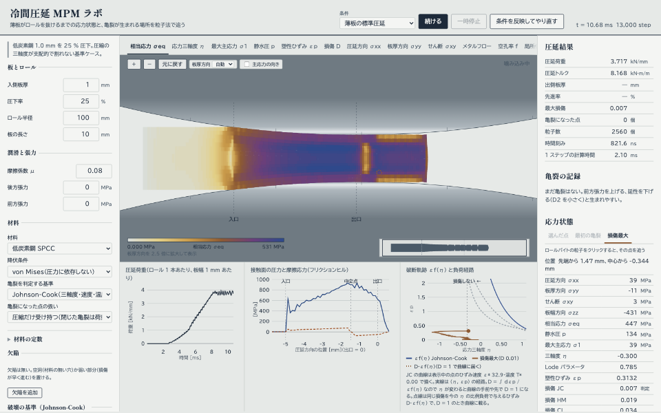

## 使い方

### 起動

Node 22.18 以降。

```bash
npm ci
npm run dev          # http://localhost:5173 を開く
```

macOS では、Finder で `MPM Rolling Lab.command` をダブルクリックしても起動できる（ターミナルが開いて開発サーバーを立て、
既定のブラウザで http://localhost:5173/ を開く。もう動いていればブラウザで開くだけ。`node_modules` が無ければ先に `npm ci`。
止めるのはそのターミナルの窓で Ctrl+C）。初回に「開発元を確認できない」と出たら、右クリック ▸「開く」。

1. 上の「条件」で名前付きの条件を選ぶ（初めは「薄板の標準圧延」）
2. 「圧延を始める」を押す。止めるのは「一時停止」、先へ進めるのは「続ける」
3. 右上に経過時間とステップ数、ロールバイトの右上に今の段階（噛み込み中・定常圧延・尾端が抜けるところ など）が出る。
   板の尾端がロールを抜けると「圧延が終わった」で止まる

左の欄で値を変えたら「条件を反映してやり直す」を押す（押すまで計算には入らない）。範囲外の値は欄が暗い赤になり、
使える範囲と、そのまま押したときに使う値が出る。

画面の区切り（左の条件と中央、中央と右の結果、ロールバイトと下のグラフ、グラフどうし）はドラッグで動かせる。
区切りにフォーカスして矢印キーでも動く（Shift で大きく）。ダブルクリックで元の位置に戻る。位置はブラウザに覚えさせる。

マウスなしでも Tab キーで画面を一巡できる。色で表す量のタブ（と平面図のタブ、「応力状態」の点の選び方）は Tab 1 回で入り、
矢印キーで隣へ、Home・End で端へ移る。

開発用のコマンド:

```bash
npm run check                     # 回帰関門（tsc と検算一式）
npm run build                     # 本番用のビルド
npm run sim -- --cells 6 --L 8    # 画面なしで 1 回圧延して数値を出す
```

### 条件の選び方

上の「条件」の一覧（中身と調整の状態は [docs/presets.md](docs/presets.md)）:

| 条件 | 見せたい現象 | 状態 |
|---|---|---|
| 薄板の標準圧延 | 圧縮が支配的で割れない | 確認済み |
| 前方張力が過大 | 出口の先で板が伸び、くびれて破断する | 確認済み（2k を超えると破断する閾値。切れる場所は掴みで決まるので示さない） |
| 厚肉・軽圧下の中心割れ | 張力なしで、厚い板の板厚中心が静水圧の引張になって割れる | 確認済み（既定の 12 セル以上。11 セル以下では割れない。延性は下げてある。`docs/presets.md`） |
| 内部欠陥（空洞）起点 | 空洞がバイトで潰れるか、出口側で開くか | 確認済み: 潰れる（点の間隔 1 つ分まで）。開かず、割れない |
| 高摩擦・低延性 | 表層から割れる | このモデルでは出ない（表層の三軸度が負のまま）。割れずに圧延される例として残す |

状態の根拠（測定の条件と結果、格子への依存）は [docs/presets.md](docs/presets.md) にある。

左の欄の組:

- **板とロール**: 入側板厚・圧下率・ロール半径・板の長さ（「板の長さの取り方」を「定常状態になるまで」にすると、定常になって定常の読みが揃うのに要る長さを自動で決める。ロール偏平・圧下率一定ではロールの調整が落ち着くぶん長い。決めた長さは圧延を始めると「板の長さ」に出る。`&length=steady`、ヘッドレスは `--length steady`）
- **潤滑と張力**: 摩擦係数 μ・後方張力・前方張力
- **材料**: 材料（低炭素鋼 SPCC・AISI 4340 鋼・アルミ合金 6061-T6）、降伏条件（von Mises・GTN）、亀裂を判定する基準、亀裂になった点の扱い、
  亀裂の面（分けない・場を分ける。下の「亀裂の面」）
- **材料の定数**（畳んである）: 加工硬化の則と定数、ひずみ速度・温度の感度、発熱（χ・比熱 cp）。材料を選び直すとその材料の値になる
- **欠陥**: 「欠陥を追加」で空洞や弱い部分（損傷が早く進む）を置く
- **破壊の基準（Johnson-Cook）**: D1〜D5、Cockcroft-Latham 限界値、損傷が進まない三軸度
- **空孔（GTN）**（畳んである）: 初期空孔率 f0、限界空孔率 fc など
- **計算**（畳んである）: 板厚方向のセル数、質量スケーリング、ロール周速

**格子で結果が変わる。** 板厚方向のセル数を増やすと細かくなるが遅い。標準条件の定常の荷重は 6 セル（板長 8 mm）で
3.24 kN/mm、10 セルで 3.11 kN/mm。スラブ法（3.03 kN/mm）より 6 → 10 → 14 → 20 セルで 7 / 3 / 5 / 5 % 高い（板長 16 mm）。
荷重は格子であまり動かないが、表層の応力や行ごとの塑性ひずみは格子でまだ動く
（[docs/validation.md](docs/validation.md)「標準条件」「スラブ法との比較」「接触」）。条件どうしを比べるときは格子を揃える。

条件は URL でも渡せる（例 `?preset=standard&cells=6&L=8&field=ep&autorun=1&stopafter=12000`。長さは mm、張力は MPa、
キーの一覧は [CLAUDE.md](CLAUDE.md)「クエリパラメータ」）。範囲外の値は黙って無視される。

### 色で表す量

ロールバイトの粒子を、上のタブで選んだ量で塗る。色と範囲は下の凡例。符号のある量は**青が圧縮側、銅が引張側**、
符号の無い量は薄い色から濃い色へ（鋼の焼き戻し色）。薄い板は見やすいように板厚方向を引き伸ばして描く
（倍率は凡例の下。計算には関係しない）。

| タブ | 量 | 読み方 |
|---|---|---|
| 相当応力 σeq | von Mises の相当応力 [MPa] | 塑性変形している点では流動応力（加工硬化で上がる） |
| 応力三軸度 η | 平均応力 ÷ 相当応力 | 下の節 |
| 最大主応力 σ1 | 最大主応力 [MPa]（板幅方向 σzz を含む 3 つのうち最大） | Cockcroft-Latham はこの引張分を積算する |
| 静水圧 p | p = −平均応力 [MPa] | 圧縮で正（青） |
| 塑性ひずみ εp | 相当塑性ひずみ | |
| 損傷 D | 選んだ判定基準の指標（0〜1）。「判定しない」では JC・HM・CL の 3 つの最大 | 1 で亀裂（「判定しない」では亀裂にしない） |
| 圧延方向 σxx・板厚方向 σyy・せん断 σxy | 応力の成分 [MPa] | x が圧延方向、y が板厚方向 |
| 温度上昇 ΔT | 塑性仕事による断熱の温度上昇 [K] | 材料の定数の χ（塑性仕事が熱になる割合、Taylor-Quinney）が 0（既定）なら全部 0 |
| メタルフロー | 最初の格子の市松模様 | 板の中の材料の流れ（下の図） |
| 空孔率 f | GTN の空孔の体積分率 | 降伏条件が GTN のときだけ 0 でない |
| 局所化の指標 | det A / 弾性の値（音響テンソル） | 1 は弾性、0 以下でせん断帯が生じうる（負は銅） |
| Drucker の指標 | σ̇:Dp / ε̇p² [MPa] | 経路に沿った流動応力の傾き。負（銅）は不安定 |

式は [docs/model.md](docs/model.md)。

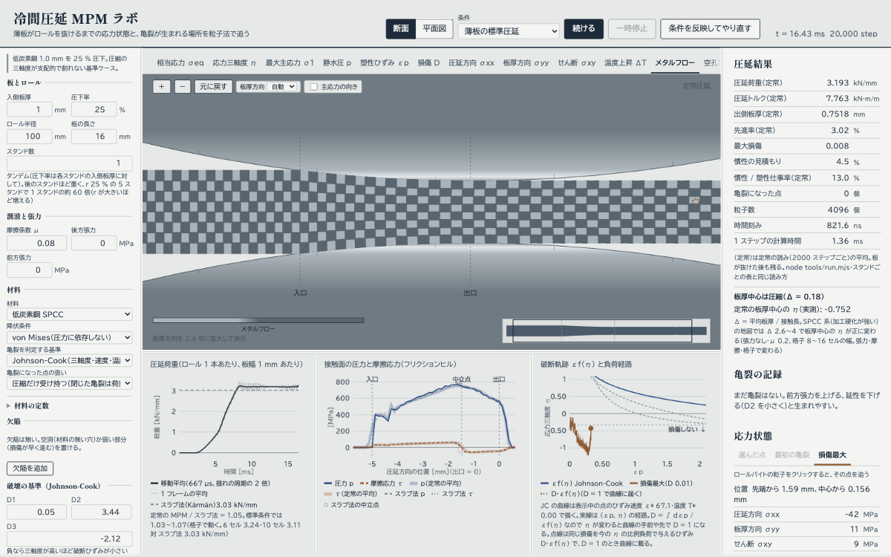

### 応力三軸度 η と破断軌跡

**応力三軸度** η = σm / σeq は、応力の「静水圧の引張」の度合い。単軸引張で 1/3、単軸圧縮で −1/3、負ほど圧縮が強い。
延性金属の破断ひずみは η が高いほど小さい（Johnson-Cook の D3 が負のとき。欄の説明のとおり）。
「損傷が進まない三軸度」（既定 −1/3、Bao-Wierzbicki）より圧縮側では Johnson-Cook と Hancock-MacKenzie は損傷を積算しない。

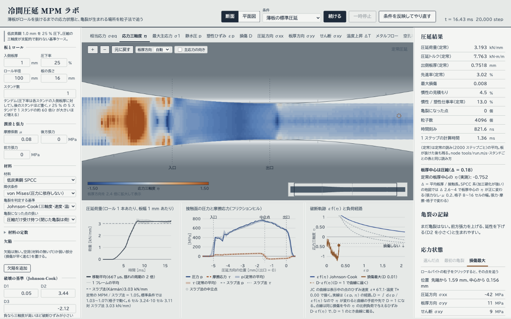

条件 `?preset=standard&cells=8&L=16&field=eta&autorun=1&stopafter=20000`（定常圧延の途中で止まる）。バイトの中は η −1.0〜−0.5（圧縮が支配的、青）、
出口の先は −0.6〜−0.2。入口の手前の青と銅のまだらは、まだ弾性で相当応力が数 MPa しかないところで η の分母が小さく振れているだけで、
塑性ひずみが無いので損傷は進まない（node で同じ条件の 20000 ステップ目: 入口の手前の σeq の中央値 6 MPa）。

**破断軌跡 εf(η) と負荷経路**（下の右のグラフ。横軸が相当塑性ひずみ εp、縦軸が応力三軸度 η）:

- **曲線 εf(η)**: 選んだ判定基準で、η を一定のまま（比例負荷で）変形したときに破断するひずみ。
  Johnson-Cook の曲線は表示中の点のひずみ速度・温度で描く。Cockcroft-Latham は平面ひずみの近似
- **実線**: 右の「応力状態」で表示中の点がたどった (εp, η) の経路（右へ進むほど変形が進む。上ほど引張寄り）
- **点線 D·εf(η)**: 今までの損傷 D を、今の η の比例負荷で与えるひずみ。**D = 1 のとき曲線に載る**。
  損傷は D = ∫ dεp / εf(η) なので、η が変わる経路では、実線が曲線に届く手前や先で亀裂になる。点線で読む
- **「損傷しない ↓」**（横の破線）: 損傷が進まない三軸度より圧縮側（線より下）
- 判定が空孔率（GTN）やせん断帯のときは曲線は無い

### 亀裂の記録

判定の指標が 1 に達した粒子は亀裂になり、ロールバイトに番号の印（朱）が押される。近くで続けて破壊した粒子は
同じ亀裂にまとめる。右の「亀裂の記録」に 1 件ずつ出る:

- 時刻と場所（上面側・下面側・板厚中心）
- 未変形の板で、先端からと板厚中心からの距離
- 破壊した瞬間の η・σ1・εp

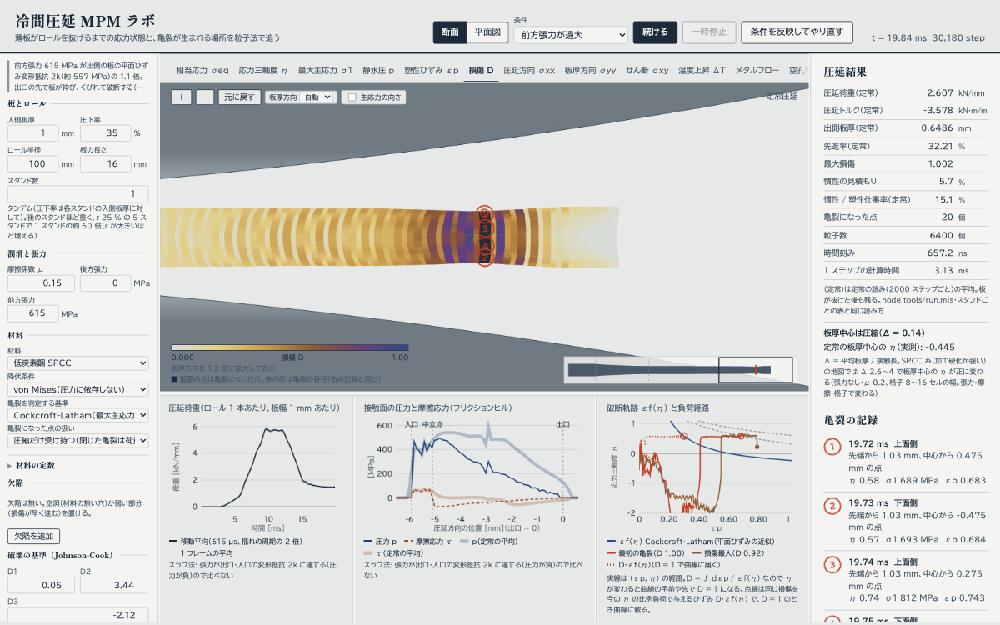

条件 `?preset=front-tension&field=damage&autorun=1`。最初の亀裂から 1500 ステップで止め、俯瞰の帯の朱の印をクリックして亀裂へ移り、ホイールで拡大した。
出口の先で板が伸びてくびれ、頭端から 1.03 mm のところで上下の面から割れて板厚を貫き（亀裂 1〜4 が 19.72〜19.76 ms にほぼ同時）、
頭端側が前方張力に引かれて離れていく。間に散らばる藍墨の小さな四角が亀裂になった点（変形させず、元の大きさで描く）。
**この絵は亀裂の面の扱いによらない**（T74）: 板厚を貫く点が一斉に壊れるので、分けない（'none'）でも同じ 4 本・亀裂になった点 20・同じ時刻で、
割れの中の点の分かれ方だけが違う。

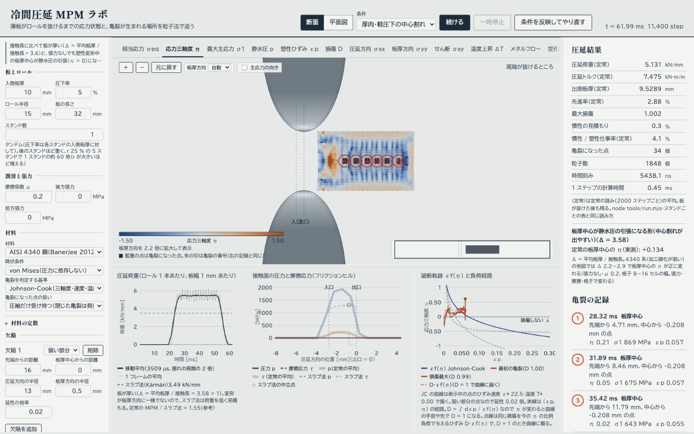

条件 `?preset=central-burst&field=eta&autorun=1`（12 セル）。板厚中心の弱い部分（延性 0.02 倍）が、張力なしでも静水圧の引張（η > 0）になって割れ、
2.9〜3.8 mm おきに板厚中心に並ぶ（1〜7。最初の亀裂から 6000 ステップ、尾端が抜けるところで止めた。亀裂になった点 14）。
右の欄の「板厚中心の形」は Δ 3.58 で「静水圧の引張になる形」、定常の板厚中心の η の実測は +0.14（下の「グラフと数値」）。
数は亀裂の面を既定の「場を分ける」で測り直した値（T74）。分けないと面が張力を伝えたまま割れが伸びるので 6 本・34 点、η は +0.13 になる。

亀裂になった点の扱いは「圧縮だけ受け持つ（閉じた亀裂は荷重を伝える）」が既定で、論文の方法は「応力をすべて失う」。

### 亀裂の面（分けない・場を分ける）

条件パネルの「材料」の **「亀裂の面」**（URL は `crack=none|dfg`）。既定の「場を分ける（面が開く）」では、亀裂の近くの節点で点を
亀裂の両側の 2 つの速度場に分け、両側は摩擦なしの接触だけで押し合う（離れるのは自由）ので、面が開いて荷重を降ろす。
「分けない（1 つの速度場）」に戻すと、亀裂の両側の点が周りの節点を共有し、格子を通じて同じ速度に引かれるので、
亀裂になった点が応力を持たなくても面の隣が荷重を持ち続ける（T74 までの既定）。
式は [docs/model.md](docs/model.md)「亀裂の面」、測定は [docs/validation.md](docs/validation.md)「亀裂の面」。

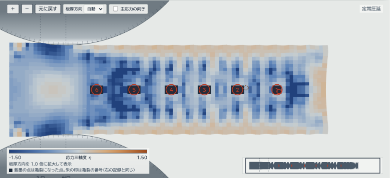

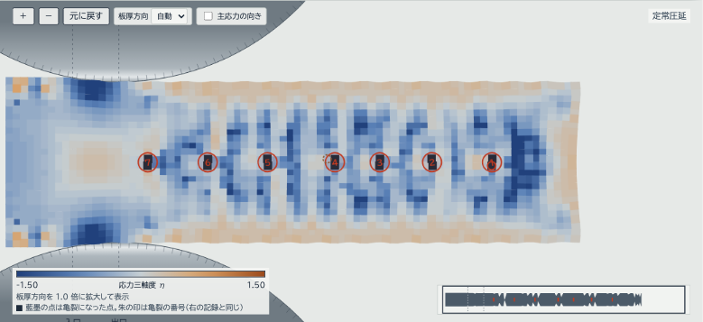

条件 `?preset=central-burst&field=eta&autorun=1&crack=none`（上）と `crack=dfg`（下）、12 セル。最初の亀裂から 4000 ステップで止め、
亀裂の列の上でホイールで拡大した。場を分けると、パスの終わりに中心割れの面を渡る σyy が平均 223 → −8 MPa・最大 457 → 37 MPa になり、
面が引張を遮るので周りの損傷が伸びず、亀裂になった点は 34 → 14（亀裂の数は 6 → 7）。
前方張力の破断のように板厚を貫く点が一斉に壊れる条件では、どちらでもすぐ開くので、絵はほとんど変わらない。
計算時間は、亀裂が出た後の 1 ステップが 1 割強増える（中心割れ 12 セルで +13 %、平面図の端割れで +12.5 %。亀裂が無いうちは「分けない」と
ビット単位で同じ結果で、時間も 3 % 以内）。

### 応力状態エクスプローラ

右の「応力状態」は 1 つの点の応力状態を表にする。表示する点を上のタブで選ぶ:

- **選んだ点**: ロールバイトの粒子をクリックすると、その点を表示して経路を追う
- **最初の亀裂**: 最初に破壊した点。「破壊した時」の値も出る（破壊した後は応力を持たない）
- **損傷最大**: 今いちばん損傷の大きい点

表の中身は、位置、応力の成分（板幅方向 σzz を含む）、相当応力 σeq、静水圧 p、最大主応力 σ1、三軸度 η、
Lode パラメータ、塑性ひずみ εp、3 つの損傷（JC・HM・CL。判定に使っているものに「判定」）など。
3 つの損傷はどの基準を選んでも積算しているので、基準の違いを 1 回の計算で比べられる。

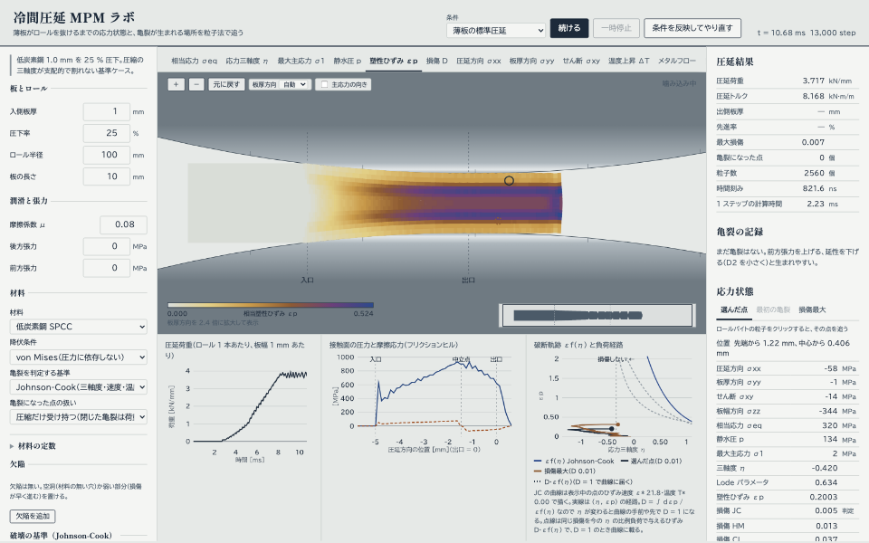

条件 `?preset=standard&cells=8&L=16&field=ep&autorun=1&stopafter=20000`、止まってから出口を過ぎた上面近くの粒子をクリック。
選んだ点に丸が付き、右の「応力状態」にその点の値、下の右のグラフに黒い線でその点の (εp, η) の経路が出る
（茶の線は損傷最大の点の経路）。

### ズーム・パン

| 操作 | 結果 |
|---|---|
| ホイール、「＋」「−」、`+` `-` キー | 拡大・縮小 |
| ドラッグ、矢印キー | 移動 |
| ダブルクリック、「元に戻す」、`0` キー | 初めの表示に戻す |
| Enter、スペース | 表示の中央に一番近い点を「選んだ点」にする（矢印キーで動かしてから押せば、その点） |
| 右下の細い帯（俯瞰）をクリック | そこへ移る |

キーはロールバイトを一度クリックするか、Tab でフォーカスしてから効く（クリックは点を選ぶことも兼ねる）。俯瞰の帯には板の全体、ロールバイト、
亀裂、今見ている範囲の枠が出る。

- **「板厚方向」**: 板厚方向の描画の倍率（自動・1 倍・2 倍・4 倍）
- **「主応力の向き」**: 十字の腕が主応力の向き。銅は引張、青は圧縮、長いほど大きい

### グラフと数値

- **圧延荷重**（ロール 1 本あたり、板幅 1 mm あたり）: 時間の推移。太い線は移動平均（窓は格子をまたぐ揺れの周期 2h/v_in の
  2 倍。h は格子の間隔、v_in は入側の板の速さ。6 セルで 889 µs）、細く薄い線は 1 フレームの平均、鋼の破線はスラブ法（Kármán）の荷重。
  定常に入ると、グラフの下の注に定常の MPM / スラブ法 の比を出す（定常の間の荷重を、フレームごとのステップ数で重み付けした平均）。
  標準条件では 1.03〜1.07（6 セル 3.24・10 セル 3.11 対 3.03 kN/mm。上の「格子で結果が変わる」）。
  板が接触長に比べて厚い（Δ = 平均板厚 / 接触長 > 1）ときは、変形が板厚方向に一様でなくスラブ法は荷重を低く見積もるので、
  注がそう替わり、比は参考になる（SPCC・μ 0.08・6 セルで、Δ 0.18 / 0.49 / 0.74 / 1.36 のとき 1.07 / 1.08 / 1.07 / 1.17。
  板厚・圧下率・ロール半径は 1 mm・25 %・100 mm / 3 mm・20 %・50 mm / 3 mm・10 %・50 mm / 4 mm・8 %・25 mm、板長は最初だけ 8 mm で他は 24 mm。
  [docs/validation.md](docs/validation.md)「画面の比」）。
  移動平均は描画だけで、結果の表と書き出しの CSV は元の値
- **接触面の圧力と摩擦応力（フリクションヒル）**: 入口から出口までの分布と中立点。スラブ法の p（破線）・τ（点線）と中立点
  （白抜きの丸）を重ねる。張力が変形抵抗 2k に達する・摩擦が固着になる・中立点がバイトの中に無い条件ではスラブ法が成り立たないので重ねず、
  凡例に理由を出す。定常の間の分布の平均（フレームごとの分布をステップ数で重み付け）を太く淡い線で後ろに描き、板が抜けた後も残す
  （その瞬間の線は板が抜けると 0 になる）。タンデムでは、1 枚のグラフにスタンドごとの定常の平均を負荷経路と同じ色で重ね、
  入口の印もスタンドごとに（接触長が違う。下の「タンデム」）
- **圧延結果**（右上）: 圧延荷重・圧延トルク・出側板厚・先進率・最大損傷・亀裂になった点・1 ステップの計算時間など。
  荷重・トルク・出側板厚・先進率は、定常の読み（2000 ステップごと）が出たら定常の平均（「（定常）」と付く。`node tools/run.mjs` と同じ読み方）で、
  板が抜けた後もその値が残る。定常の前はその瞬間の値。板が短く定常の読みが無いときは「—」と理由。タンデムでは表示中のスタンドの値
- **板厚中心の形**（圧延結果の表の下）: 条件の Δ（平均板厚 / 接触長）を、中心割れの地図（`docs/validation.md`「中心割れの地図」）の境目に照らして、
  「板厚中心は圧縮」「引張に変わる境目の近く」「静水圧の引張になる形（中心割れが出やすい）」の一言。境目は加工硬化の弱い材料（4340 系、Δ 2.1〜2.9）と
  強い材料（SPCC 系、2.2〜3.7）で分ける（εp 0.5 と 0 の流動応力の比が 2 未満なら 4340 系）。幅は地図を測った格子（8〜20 セル）の幅で、
  細かい格子ほど小さい Δ で正に変わる。地図は張力なし・μ 0.2 なので、張力・摩擦で変わる。
  定常に入ると、ロールバイトの中の板厚中心の η の実測（地図と同じ測り方）を並べる。タンデムでは表示中のスタンドの入側板厚で

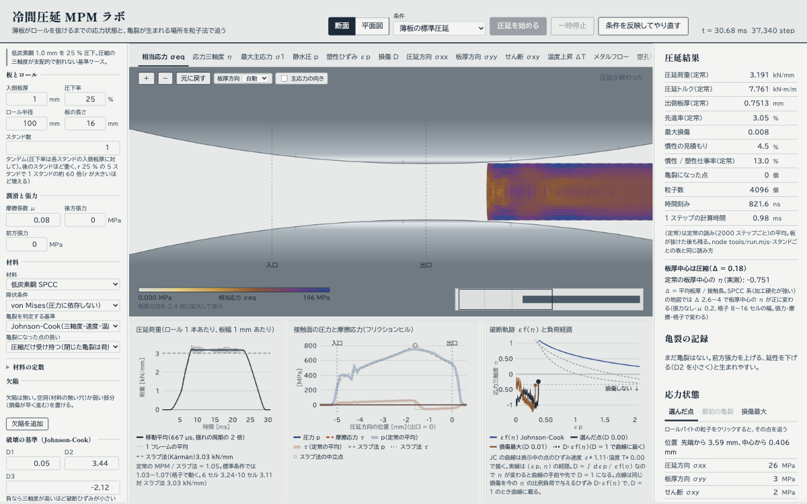

条件 `?preset=standard&cells=8&L=16&autorun=1`、パスの後。荷重のグラフは噛み込み → 定常 → 尾端が抜けるまで（鋼の破線がスラブ法）。
フリクションヒルはその瞬間の線が 0 になり、定常の間の平均（太く淡い線）が残る。表の荷重・トルク・出側板厚・先進率に「（定常）」が付く。

### 書き出し

右の「結果の書き出し」。数値は丸めずに書く。

| ボタン | ファイル | 中身 |
|---|---|---|
| 荷重の推移（CSV） | `rolling-force-step<n>.csv` | 時刻 [ms]、荷重 [kN/mm]、トルク [kN·m/m] |
| 圧力分布（CSV） | `contact-pressure-step<n>.csv` | 位置 [mm]、接触圧力と摩擦応力 [MPa] |
| 亀裂の一覧（CSV） | `cracks-step<n>.csv` | 亀裂ごとの時刻・ステップ・位置・η・σ1・σeq・εp・判定基準・粒子数 |
| ロールバイト（PNG） | `roll-bite-step<n>.png` | 今のロールバイトの絵 |
| 条件の URL をコピー | — | 今の条件で始まる URL。開くと同じ条件で始まる |

### ロール偏平と圧下率一定

条件パネルの「板とロール」に 2 つの選択がある（断面の画面だけ。どちらも既定は切）。

- **ロール偏平**「Hitchcock（計算した荷重と連立）」（URL は `&flatten=hitchcock`、ロールのヤング率は `&rollE=206` GPa）: 圧延しながら、MPM が計算した荷重 P から
  Hitchcock の式 R' = R (1 + C P / Δh)、C = 16 (1 − ν²) / (π E) でロールの半径を R' にしていく。荷重と R' が釣り合ったら止めて保持する。
  標準条件で R 100 → R' 135 mm、荷重 3.24 → 3.92 kN/mm
- **圧下率の取り方**「圧下率一定」（URL は `&control=reduction`）: ギャップ一定だと板の弾性の戻りとロール偏平のぶん板が厚く出る（実際の圧下率が入力より小さい）。
  圧下率一定は、出側の板厚を測ってロールギャップを詰め、実際の圧下率を入力した値にする（標準条件で ± 0.05 % の板厚）

落ち着くまでは相が「ロールを調整中」で、定常の平均はそのあとから取る（そのぶん板を長めに。標準条件・6 セルで 24 mm）。圧延結果に **実際の圧下率**・**ロール半径 R'**・**ロールギャップ** の行が増え、
ロールの絵とスラブ法の重ね描き（偏平ロールのスラブ法）も追従する。タンデムではスタンドごとに行い、スタンドごとの結果に R' とギャップが出る。
ヘッドレスでは `node tools/run.mjs --cells 6 --L 24 --flatten hitchcock --control reduction`。モデルは `docs/model.md`「ロール偏平と圧下率一定」、実測は `docs/validation.md` の同じ見出し。

### タンデム（スタンドを続けて通す）

条件パネルの「板とロール」の **スタンド数**（1〜5。URL は `?stands=3`）を 2 以上にすると、同じ条件のスタンドに板を順に通す。
どのスタンドも圧下率は自分の入側板厚に対して取り、次のスタンドの入側板厚は前のスタンドから出てきた板の厚さ（弾性の戻りを含む）。
材料の状態（ひずみ・損傷・亀裂）は次のスタンドへ引き継ぐ。スタンドは 1 台ずつ順に解く（実機のように同時には噛まない）。
モデルは `docs/model.md`「タンデム」、ヘッドレスでは `node tools/tandem.mjs --stands 3 --cells 6 --L 8`。

スタンド数の下の **スタンドの引き継ぎ** を「定常になったらすぐ（速い）」（URL は `&handoff=steady`）にすると、板が全部抜けるのを待たず、
定常になったところで次のスタンドを始める。次の板は、出側の定常に圧延された部分を繰り返して作る（頭端・尾端の非定常な部分は引き継がない）。
3 スタンド・6 セル・板長 16 mm で 245 s → 40 s、定常の荷重は 0.7 % 以内で同じ。最大損傷は頭端を含まない分だけ小さく出る（`docs/validation.md`「定常での引き継ぎ」）。
最初の板が短くて定常の読みが 2 つ取れないときは、これまでどおり板が抜けてから引き継ぐ。

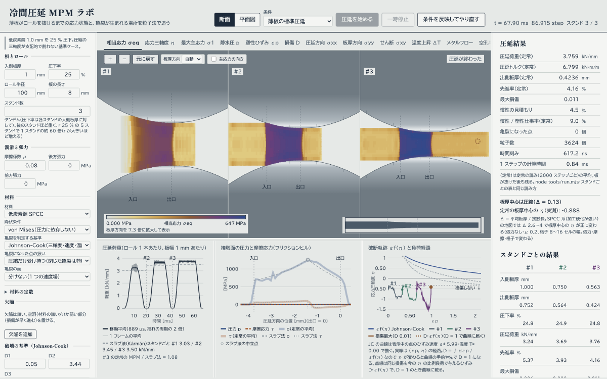

条件 `?stands=3&cells=6&L=8&autorun=1`、パスの後。入側板厚 1.000 → 0.750 → 0.563 mm、荷重 3.24 → 3.69 → 3.76 kN/mm
（前のスタンドまでの加工硬化で上がる。スラブ法も 3.03 → 3.45 → 3.50 kN/mm）。

- **ロールバイト**: スタンド数ぶん横に並ぶ（720 px 以下では縦に、表示の操作と俯瞰の下から）。計算中のスタンドだけが動き、終わったスタンドは定常中の絵
  （尾端が表示窓の左端を過ぎたところ。板が窓いっぱいに入り、バイトは定常）を残す（左上に `#2（計算中）`・`#3（まだ）`）。
  パスが終わると最後のスタンドも定常中の絵に戻る（圧延結果の表・亀裂の記録・書き出しは終わりの状態のまま）。縮尺は最初のスタンドの板に合わせて共通、色の範囲も並んだ絵で共通。
  拡大・パン・板厚方向の倍率・主応力の向き・点の選択は計算中のスタンドの枠で（パスの後は最後のスタンドの枠で）操作する。終わった枠はマウスには応えず、同じ倍率・位置で追従する。色の量を替えると、終わったスタンドも描き直す
- **破断軌跡と負荷経路**: 表示中の点の経路をスタンドごとに色を替え（#1 薄い藍墨、#2 緑青、#3 紫、#4 黄土、#5 紅紫）、各スタンドの
  始まりに番号の点を打つ。凡例にもスタンドの番号
- **圧延荷重**: 時間はパス全体の通し（スタンドを順につなぐ）。スラブ法の破線はスタンドごとの高さで、2 台目からは区間の頭に `#k`（1 台目はグラフの左端から）。凡例にスタンドごとの値、
  注に表示中のスタンドの定常の MPM / スラブ法（`#k の定常の MPM / スラブ法 = …`。1 スタンドの標準条件の範囲は出さない）。
  2 台目以降のスラブ法は前のスタンドまでの加工硬化を入れる（ひずみ ε0 = (2/√3) ln(h0,1 / h0,k) から。`docs/validation.md`「スラブ法」）
- **フリクションヒル**: 1 枚のグラフに、スタンドごとの定常の平均を負荷経路と同じ色で重ねる（p は太い実線、τ は細い破線。凡例に `#k`）。
  済んだスタンドの分もパスの後まで残る。その瞬間の線は表示中（計算中）のスタンドのもので、スラブ法も表示中のスタンドだけ
  （全部重ねると読めないため）。入口の縦線はスタンドごとに、その色で（接触長が違う。ラベルは重ならないよう段を分ける）
- **圧延結果の表**: 表示中（計算中）のスタンド。表題の右の時計に `スタンド 2 / 3`
- **残り時間**（右上、時計の上の「残り 約 3 分 20 秒」）: 計算中だけ出る推定。板の尾が進んだ分（バイトに入ってからの加速を入れて時間に換算）を直近 12 秒の実時間と比べる。一時停止の間は数えない。
  タンデムのまだ始まっていないスタンドは、前のスタンドの所要時間に倍率を掛けた見込み（2 スタンド済むと実測の比）。断面・平面図・3 次元で共通
- **スタンドごとの結果**（右列、圧延結果の下）: スタンドを列に、量ごとに名前の行と値の行。入側板厚・出側板厚・圧下率・圧延荷重・平均変形抵抗（バイトの中の 2k = (2/√3)σy の接触長に沿った平均）・ロール半径 R'・ロールギャップ（偏平・圧下率一定のときはスタンドの終わりの値）・
  先進率・最大損傷・亀裂の点・生まれた亀裂（そのスタンドで始まった亀裂の記録）・伸びた面積（そのスタンドで亀裂になった材料の断面の
  面積 mm²。前のスタンドから持ち越した亀裂を細かい格子で数え直した分は入れない）。
  荷重・出側板厚・先進率は各スタンドの定常の平均で、`tools/tandem.mjs` と同じ読み方（同じ条件なら 1 台目はブラウザと node で相対 1e-5 以内。
  2 台目からは、エンジンの最後の 1 ビットの差を計算が大きくするので、荷重で 1e-3 程度まで。`tools/browser/tandem.mjs` の冒頭）。
  板が短く定常の読みが無いスタンドは「—」で、表の下にそう書く。
  板が厚さを貫く亀裂で切れた（実機の板切れと同じく次のスタンドへ送らない）・点が格子の外へ出た・噛み込めない、のどれかで止まったら、
  その先は計算せず（枠は `#3（計算しない）`）、表の下に理由を書く。点が格子の外へ出たスタンドがあれば「失われた質量」の行を足す
- **亀裂の記録**: 始まったスタンド（`#k`）と、パスの通しの時刻
- **書き出し**: CSV の時刻とステップはパスの通しで、末尾に `stand` 列（1 始まり）。PNG はスタンドを横に並べた 1 枚。
  1 スタンドのときの書き出しは今までと同じ

### 平面図（板幅方向、耳割れ）

表題の行の「平面図」で、板を上から見るモデルに切り替わる（板厚方向は平均し、板幅を解く。`src/mpm/planview/`）。
耳割れ（端の割れ）と幅広がりはこちらで見る。「断面」で元の画面に戻る。切り替えると、表示しない方の計算は一時停止して
そのまま残る。「条件を反映してやり直す」とプリセットの変更は、両方を同じ条件で初めからにする（走るのは表示している方だけ）。
切り替えだけではパネルの未反映の編集は反映しない。

- 条件は上の板とロール・潤滑・材料・破壊の基準・亀裂の面をそのまま使い、パネルの頭の **「板幅（平面図）」** で板幅・半幅のセル数・
  端の切り欠き（半径、板幅の 1/4 まで）を足す。既定は板幅 20 mm・10 セル（粗い。板長 28 mm で 1 回 4〜5 秒、既定の板長 16 mm なら 2 秒ほど）。
  断面の欠陥は平面図には入れない（平面図の欠陥は端の切り欠きだけ）
- **定常の値は、頭端が出口の先に、尾端が入口の手前にそれぞれ「8 mm か半幅の大きい方」以上ある間の平均**（板幅の中央の荷重は、
  頭端が出口の先へ半幅ほど進むまで上がり続け、尾端が入口の手前半幅ほどに来ると下がり始める）。板が短いと読みが無いので、
  板の長さを「その間隔の 2 倍と 8 mm」以上にする（既定の板幅 20 mm で 28 mm、60 mm で 68 mm。16 mm では出ない）。数値は `node tools/planview.mjs` と同じ読み方で、同じ条件なら相対 2e-6 以内で合う（ブラウザと node で
  Math.exp・log の最後の 1 ビットが違うため、ビット単位では一致しない）
- 結果の表: 中央の単位幅荷重・半幅平均の単位幅荷重・幅広がり（端ごと）・中央の出側板厚・最初の亀裂の時刻など
- **荷重は総荷重（半幅平均）が使える。幅方向の配分（中央の単位幅荷重）は定量でない**: 半幅平均は平面ひずみと ±1 % で合うが、中央は端の影響（端から 21〜28 mm）で
  W/h0 20 で 3 割高く出る（[docs/model.md](docs/model.md)「平面図モデル」の「使える範囲」）
- 体積の扱いは断面と同じ（既定は格子で平均する 'rate'）。バイトの中は板厚の拘束で体積ロッキングが出るので、平均しないと粒子ごとの圧力と
  三軸度がばらつき、その裾で耳割れが早く・広く出ていた（[docs/validation.md](docs/validation.md)「体積の平均化（平面図）」）

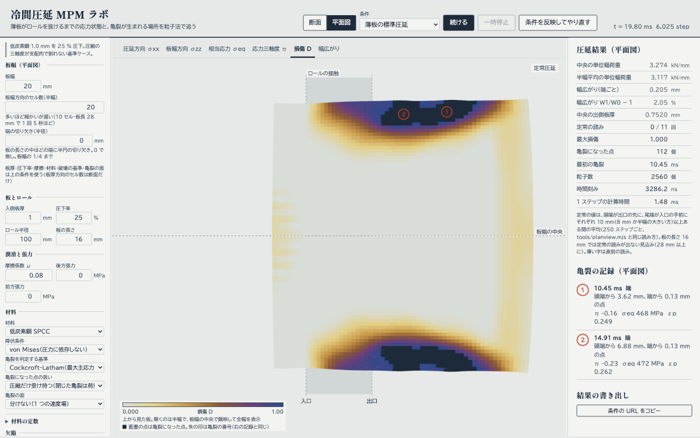

条件 `?view=plan&W=20&wcells=20&L=16&damage=cockcroft-latham&cond=eyJkYW1hZ2UiOnsiY2xDcml0IjowLjF9fQ&pfield=damage&autorun=1`
（板幅 20 mm・半幅 20 セル・板長 16 mm、Cockcroft-Latham の限界値 0.1。`cond` は「破壊の基準」の欄の値）に `&crack=none`
（亀裂の面を分けない。下の図が既定の「場を分ける」）、6000 ステップで止めた。
上下が板の端（下半分は板幅の中央で鏡映）。端はバイトの中で中央に引っ張られて引張になり、端に沿った帯で損傷が溜まって割れる
（この時点で亀裂になった点 112、最初の亀裂は 10.45 ms・頭端から 3.62 mm・端から 0.13 mm = 最外の列）。
割れは端に沿って伸び、圧延方向に直角の耳割れにはならない（[docs/model.md](docs/model.md)「平面図モデル」）

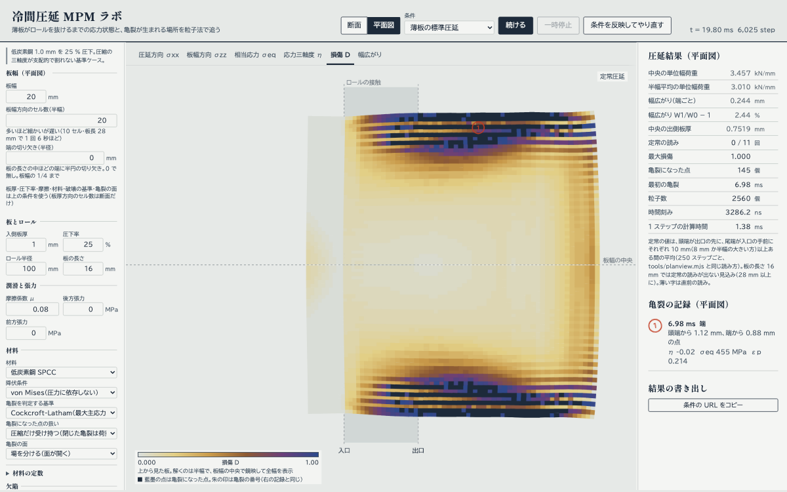

同じ条件を既定の `&crack=dfg`（場を分ける）で。場を分けても、端が一様なら耳割れは端に沿った帯のまま。亀裂になった点は少し減る（112 → 106）。
端はバイトの中で長さ方向にほぼ一様に引張なので一斉に壊れ、帯の内側は圧縮なので、先端が板幅の中へ進まない
（[docs/validation.md](docs/validation.md)「亀裂の面」の「平面図」）。
体積の平均化（上）が入る前は、粒子ごとの圧力のむらで割れやすく、同じ条件で 209 → 145 点だった
**端の延性のばらつき**（パネルの「端の延性のばらつき（平面図）」、既定は 0 = 無し）を入れると、端から数えた帯の中で
延性を 1 −（ばらつきの大きさ）× u 倍する（u は 0〜1 の乱数。種と圧延方向の位置だけで決まるので、同じ条件は同じ板）。
端の組織・介在物・トリミングの傷の代わりで、一様な端の「端に沿った帯」が離れた複数の割れになる
（20 %・帯 1 mm・相関長 1 mm、Cockcroft-Latham 0.13 で 1 本 → 3〜4 本（種 6 つの中央値 3 本）、間隔の中央値 2.5 mm。種を変えると本数と場所が変わる）。
ばらつきの大きさ・帯の幅・相関長（同じ値が続く長さ）・種の 4 つが条件で、0 のときは今までとビット単位で同じ計算になる。
割れの本数と間隔は格子の細かさにまだ依り（h 0.5 → 0.25 mm で、種によって 3 → 4 本）、間隔に合わせられる実測値も無い
（[docs/model.md](docs/model.md)「端の延性のばらつき」、[docs/validation.md](docs/validation.md)の同じ名前の節）

- URL: `?view=plan&W=20&wcells=10&notch=0.5&pfield=sxx`（板幅 mm、半幅のセル数、切り欠きの半径 mm、色の量）。
  端のばらつきは `&escatter=20&ewidth=1&elen=1&eseed=1`（大きさ %、帯の幅 mm、相関長 mm、種。`escatter=0` のときは 4 つとも書かず、ばらつきを入れたときは種を既定のままでも書く）。
  ほかの条件のキーは断面と同じ。「条件の URL をコピー」は平面図のキーも書く。粒子が 50 万点を超える組み合わせ（細い板幅に
  多いセル数、長い板）は板幅とセル数を既定に戻し、板幅の 1/4 より深い切り欠きは無視し、半幅より広い帯は半幅に切り詰める

### 3 次元（板幅方向の変形も解く）

表題の下の「3 次元」のタブで、板幅方向も解く 3 次元の計算に切り替わる（`src/mpm/solid/`）。今までの画面（断面・平面図・タンデム・ロール偏平 …）は
全部「2 次元」のタブにある。3 次元は別の計算で、タブを移ると見えなくなる方は一時停止する。

- 条件の欄の「板と格子（3 次元）」で板幅（2〜200 mm。時間は板幅に比例し、40 mm で約 14 分）・板の長さ・板厚方向のセル数（4・6・8）を決める。板厚・圧下率・ロール半径・摩擦・材料・
  破壊の基準は 2 次元と共通。**スタンド数（タンデム）・スタンドの引き継ぎ・ロール偏平・圧下率一定・板の長さの取り方（「定常状態になるまで」）**も
  2 次元と同じ欄で決める。前後の張力（「潤滑と張力」の欄）も効く。GTN・亀裂の面は 3 次元には無い
- タンデムは、出てきた板の板厚と**板幅**（幅広がりのぶん広い）と**断面の形**（端のふくらみ、板厚のむら）を次のスタンドの入側にして、応力・ひずみ・損傷を引き継ぐ。右の欄に「スタンドごとの結果（3 次元）」が出る。
  後のスタンドほど格子が細かく重いので、引き継ぎは「定常になったらすぐ」が速い
- 結果: 全幅の圧延荷重、板幅あたりの荷重（スラブ法の平面ひずみと並べて）、出側の板幅と**幅広がり**、板幅の中央と端の出側板厚、先進率。
  下のグラフは荷重の推移、**板幅方向の荷重の分布**、接触圧力を上から見た図、**破断軌跡 εf(η) と負荷経路**（2 次元と同じ読み方。タンデムではスタンドごとに色を替える）
- 右の「応力状態（3 次元）」は 2 次元の応力状態エクスプローラと同じ表（σyz・σzx と板幅の中央からの位置が加わる。Lode パラメータは 3 つの主応力から）。
  表示する点は「最初の亀裂」と「損傷最大」の 2 つ（3 次元の絵では点は選べない）。絵の上ではその 2 点を、最初の亀裂は**赤の点線の丸**、損傷最大は茶の点線の丸で囲う（凡例にも出る。鏡映した側にも）。最初の亀裂の点は、タンデムでは後のスタンドの子孫の点で、経路は最初のスタンドから続く
- 絵はドラッグで動かす、Shift+ドラッグで回す（回転の軸は今の画面の中央。ホイールで拡大、ダブルクリックで元に戻す）。「上から」で幅広がりが、「板幅の中央で切る」で中の応力が見える
- **巻き戻して再生**: 計算が止まると（終わっても、一時停止でも）絵の下に「巻き戻す」「再生」とスライダーが出て、記録した絵を最初から見直せる。色の量のタブ・向き・拡大はそのまま効き、時計と荷重のグラフの印（「再生」）がその絵の時刻を指す。記録は数百枚まで（長い計算は等間隔に間引く）。スライダーの右端が今の絵で、「続ける」「やり直す」でも今の絵に戻る
- 標準条件・板幅 8 mm・4 セルで約 2.5 分（1.2 万点）。幅広がり 7.9 %、板幅あたりの荷重は平面ひずみの 0.95 倍（`docs/validation.md`）
- 「板幅方向を止めて解く（平面ひずみ）」にすると 2 次元の断面と同じ問題になる（荷重 +1.4 %。3 次元の計算の確かめ用）
- ヘッドレス: `node tools/solid.mjs --W 8 --L 12 --cells 4`（`--length steady`、`--stands 3 --handoff steady`、`--flatten hitchcock --control reduction`）。
  URL: `?dim=3&W3=8&L3=12&cells3=4&ps3=1&f3=spread`（`&stands=3&handoff=steady&length=steady&flatten=hitchcock&control=reduction` は 2 次元と共通のキー）

### モデルの限界

数値を読む前に [docs/model.md](docs/model.md)「既知の限界」を見る。主なもの: 断面は 2D 平面ひずみで板幅方向が無いので
耳割れは扱えない（平面図のモデルで見る。板厚方向を平均するので、こちらは板厚方向の分布が無い）。ロールは剛体（偏平しない）。計算を速めるために質量スケーリング（既定 1e4 倍）を使っている。
ロールの拘束は最寄りの行までかかるので、最外層の粒子が受け持つのはロールの圧力の 9 割前後（6 セル 0.88、10・14 セルで 1.0 前後。
荷重と接触面の分布は節点の力積から出す）。既定は亀裂の近くで速度場を 2 つに分ける（「亀裂の面」）ので面は開くが、
二次の B スプラインの台（3 セル）より細い亀裂では分かれ方が格子に依存する（「分けない」に戻すと亀裂はきれいに開かない。
平面図の耳割れは、分けても端に沿った帯のまま）。体積の扱いは作り直した（'rate'。ロールの近くの係数も接触を直した T27 で 1 に戻した）が、
板厚中心の三軸度はまだ格子で動く。検証の値と測定条件は [docs/validation.md](docs/validation.md)。

## 文書

- [docs/model.md](docs/model.md) — 式、参考文献との対応、既知の限界
- [docs/validation.md](docs/validation.md) — 検証値と測定条件
- [docs/presets.md](docs/presets.md) — 名前付きの条件と調整の状態
- [docs/design.md](docs/design.md) — 画面のデザイン
