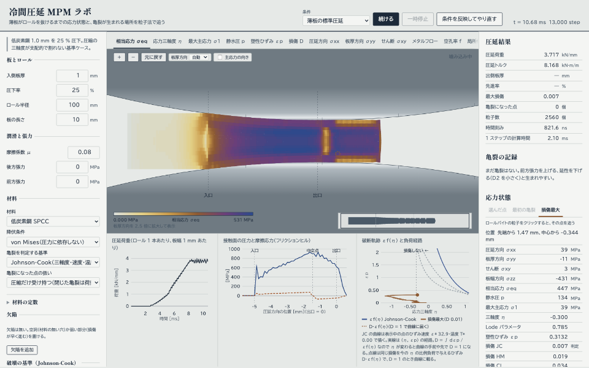
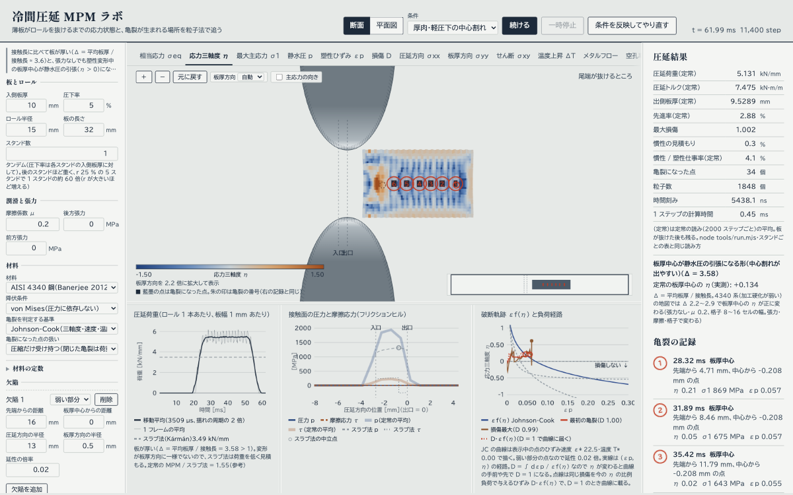
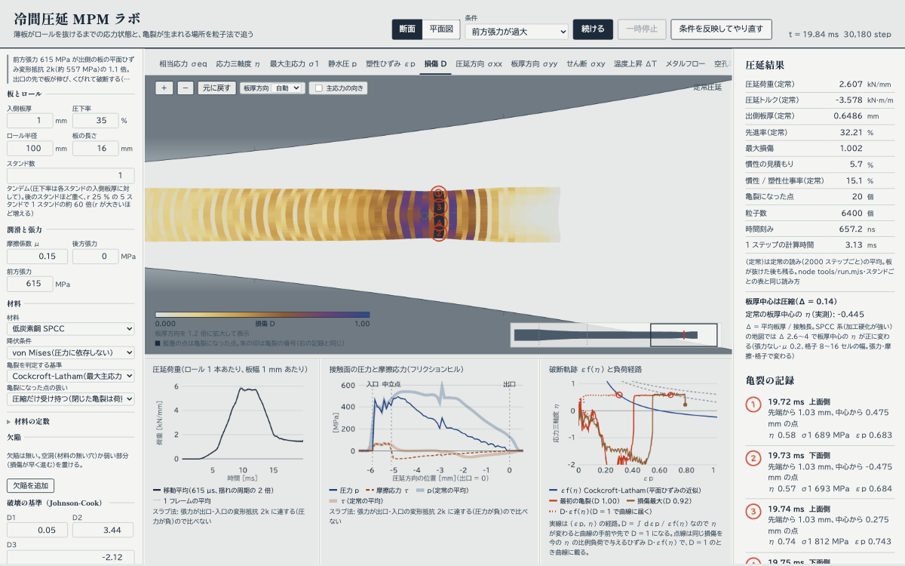
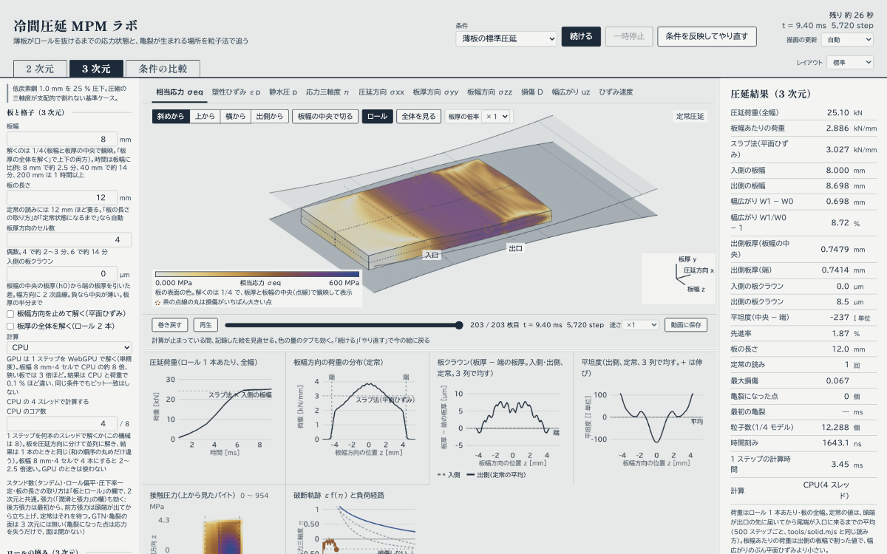
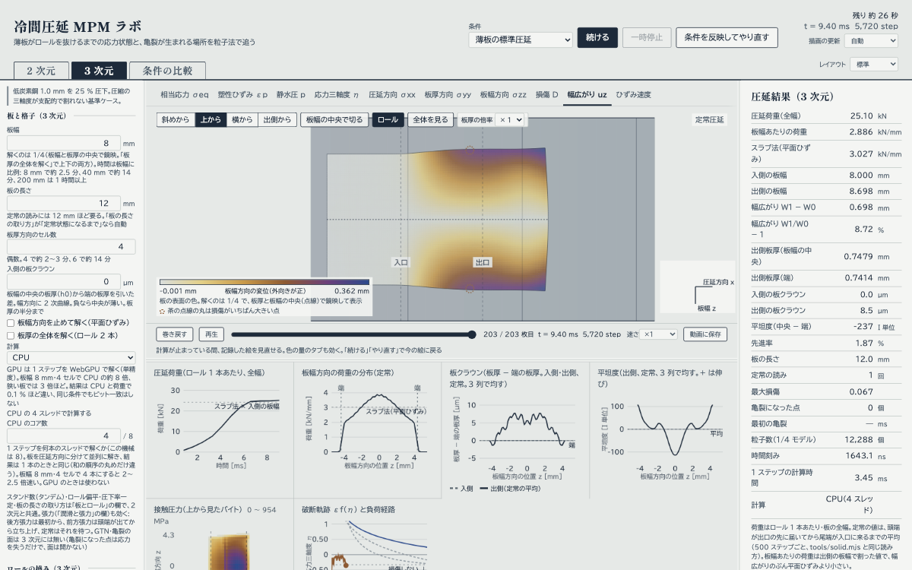
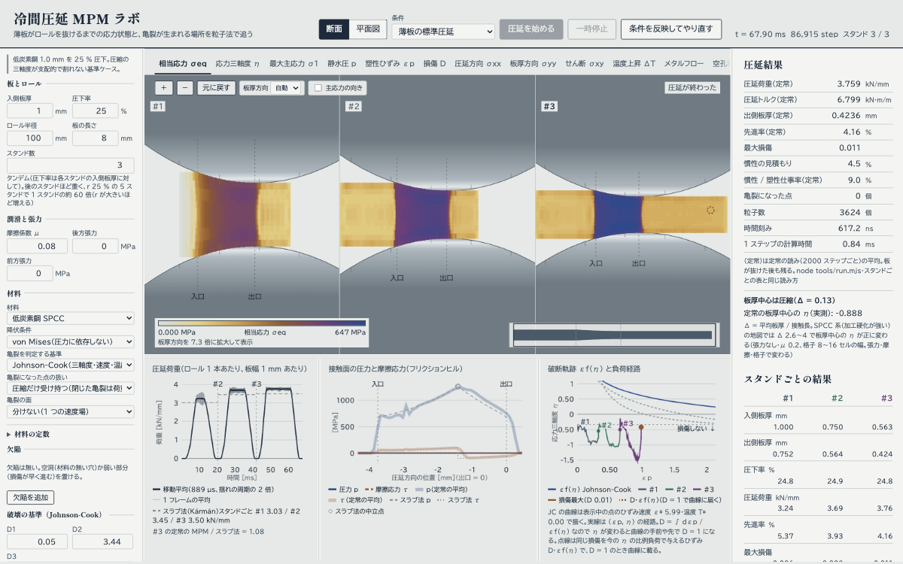
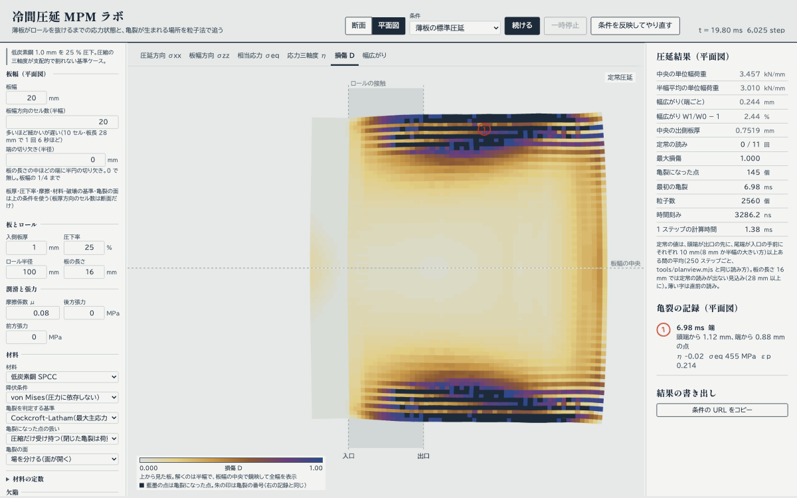
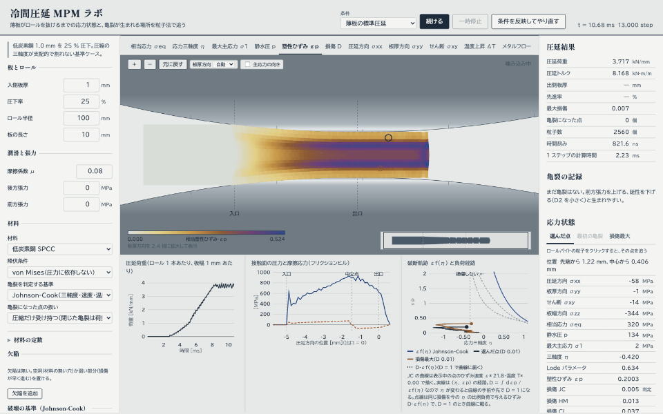
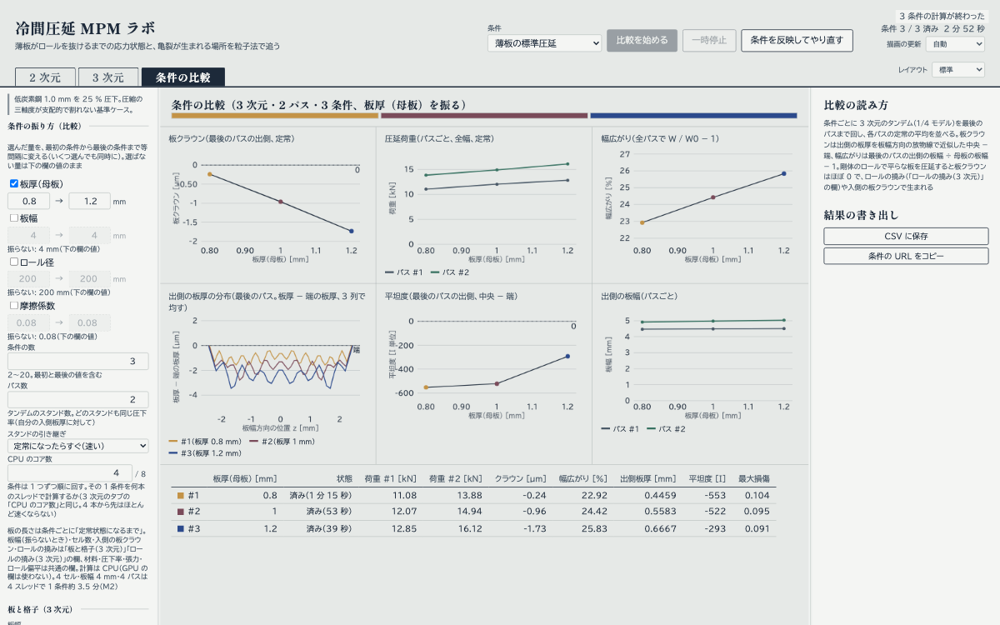
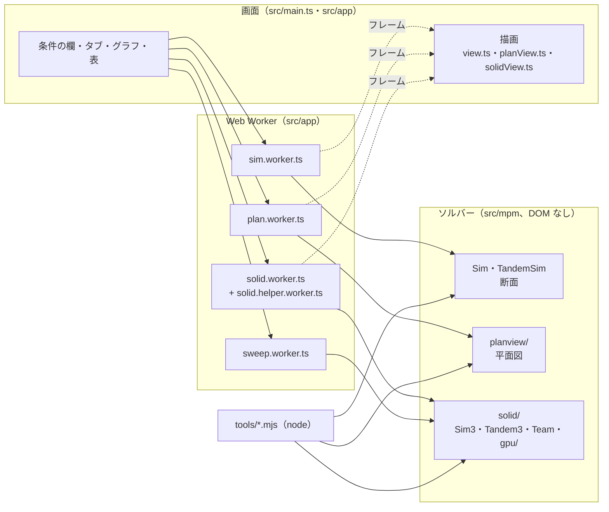

# MPM Rolling Lab — 冷間圧延 MPM ラボ

薄板の冷間圧延を **material point method（MPM）** で解き、板の中の応力状態から
**亀裂がどこで・いつ・どんな応力状態で生まれるか** を見るブラウザアプリ。

*A browser-based material point method simulator for cold rolling of thin sheet: roll force, friction hill,
stress triaxiality and ductile crack initiation, in 2D section, plan view and 3D — no install beyond Node.*



- **ブラウザだけで動く**: 計算は Web Worker（3 次元は複数スレッドと WebGPU も）。サーバーの計算資源は要らない
- **応力状態で割れを判定する**: 応力三軸度 η・Lode パラメータ・塑性ひずみを粒子ごとに追い、Johnson-Cook などの延性破壊の基準で亀裂にする
- **解析解と突き合わせてある**: スラブ法（Kármán）・Bland & Ford の解析解と荷重・中立点・先進率を比べ、格子への依存も含めて [docs/validation.md](docs/validation.md) に残している
- **ヘッドレスでも同じ計算**: ソルバーは DOM に依存しない TypeScript で、`node` からそのまま回せる

## 目次

- [できること](#できること)
- [すぐに試す](#すぐに試す)
- [名前付きの条件](#名前付きの条件)
- [モデル](#モデル)
- [検証](#検証)
- [画面なしで回す](#画面なしで回す)
- [構成](#構成)
- [開発](#開発)
- [モデルの限界](#モデルの限界)
- [文書](#文書) ・ [参考文献](#参考文献)

## できること

画面は 3 つのタブに分かれる。どれも同じ条件の欄（板・ロール・潤滑・材料・破壊の基準）を使う。

| タブ | 解くもの | 見るもの |
|---|---|---|
| **2 次元・断面** | 圧延方向 × 板厚方向の平面ひずみ | ロールバイトの応力場、荷重、フリクションヒル、破断軌跡、中心割れ・張力破断 |
| **2 次元・平面図** | 圧延方向 × 板幅方向（板厚は平均） | 幅広がり、端の引張、耳割れ |
| **3 次元** | 圧延方向 × 板厚 × 板幅（1/4 モデルか板厚全体） | 幅広がり、板幅方向の荷重分布、クラウンと平坦度、ロールの撓み |
| **条件の比較** | 3 次元のタンデムを、条件を振って何本も | 母板の板厚・板幅・ロール径・摩擦に対する、数パス後のクラウン・荷重・幅広がり |

<table>
<tr>
<td width="50%"><br><b>中心割れ</b>: 厚い板・軽い圧下で、板厚中心が静水圧の引張（η &gt; 0）になって割れが並ぶ</td>
<td width="50%"><br><b>張力破断</b>: 前方張力が変形抵抗を超えると、出口の先で板がくびれて板厚を貫いて切れる</td>
</tr>
<tr>
<td><br><b>3 次元</b>: 板幅方向も解く。ドラッグで動かし、Shift+ドラッグで回す。止まったら巻き戻して再生、MP4 に保存</td>
<td><br><b>幅広がり</b>: 上から見ると、ロールバイトで板の端が外へ流れるのが分かる</td>
</tr>
<tr>
<td><br><b>タンデム</b>: 1〜5 スタンド。ひずみ・損傷・亀裂を次のスタンドへ引き継ぎ、負荷経路をスタンドで色分けする</td>
<td><br><b>平面図</b>: 板の端がバイトで引張になり、端に沿って損傷が溜まる</td>
</tr>
<tr>
<td><br><b>応力状態エクスプローラ</b>: 粒子をクリックすると応力の成分・η・Lode・3 つの損傷を表にし、(εp, η) の経路を破断軌跡に重ねる</td>
<td><br><b>条件の比較</b>: 母板の条件を等間隔に振り、最後のパスのあとのクラウン・荷重・幅広がりを並べる</td>
</tr>
</table>

ほかに: 色で表す量 15 種（相当応力・三軸度・主応力・静水圧・塑性ひずみ・損傷・メタルフロー・空孔率・局所化の指標 …）、
スラブ法の荷重・圧力分布の重ね描き、ロール偏平（Hitchcock）と圧下率一定の制御、前後方張力、欠陥（空洞・弱い部分）、
板厚方向の対称モデル（約 2 倍速い）、CSV・PNG・条件の URL の書き出し、キーボードだけでの操作。
画面の一つ一つの説明は [docs/usage.md](docs/usage.md)。

## すぐに試す

Node 22.18 以降（型の除去が既定で有効な版）。ブラウザは Chrome で確かめている（3 次元の GPU は WebGPU のあるブラウザ、複数スレッドは `SharedArrayBuffer` の使えるページ = dev / preview サーバー）。

```bash
git clone <このリポジトリ>
cd <リポジトリのディレクトリ>
npm ci
npm run dev          # http://localhost:5173 を開く
```

1. 上の「条件」で名前付きの条件を選ぶ（初めは「薄板の標準圧延」）
2. 「圧延を始める」を押す。止めるのは「一時停止」、先へ進めるのは「続ける」
3. 板の尾端がロールを抜けると「圧延が終わった」で止まる。右の「圧延結果」に定常の荷重・トルク・出側板厚・先進率が出る

条件は URL でも渡せる。開いてすぐ回す例:

| 見たいもの | URL（`http://localhost:5173/` に続ける） |
|---|---|
| 標準圧延を粗い格子で（数秒） | `?preset=standard&cells=6&L=8&autorun=1` |
| 中心割れ | `?preset=central-burst&field=eta&autorun=1` |
| 前方張力で板が切れる | `?preset=front-tension&field=damage&autorun=1` |
| 3 スタンドのタンデム | `?stands=3&cells=6&L=8&handoff=steady&autorun=1` |
| 平面図の耳割れ | `?view=plan&W=20&wcells=20&L=16&damage=cockcroft-latham&pfield=damage&autorun=1` |
| 3 次元（板幅 8 mm、約 2.5 分） | `?dim=3&W3=8&L3=12&cells3=4&autorun=1` |
| 3 次元を WebGPU で | `?dim=3&W3=8&L3=12&cells3=4&gpu3=1&autorun=1` |
| 板厚を振った比較 | `?dim=c&W3=4&cells3=4&sv=h0:0.8:1.2&sn=5&sp=2&autorun=1` |

長さは mm、張力は MPa、圧下率 `r` は %。範囲外の値は黙って無視される。キーの一覧は [CLAUDE.md](CLAUDE.md)「クエリパラメータ」。
画面の「条件の URL をコピー」で、今の条件の URL が取れる。

macOS では、Finder で `MPM Rolling Lab.command` をダブルクリックしても起動できる（初回に「開発元を確認できない」と出たら、右クリック ▸「開く」）。

## 名前付きの条件

| 条件 | 見せたい現象 | 状態 |
|---|---|---|
| 薄板の標準圧延 | 圧縮が支配的で割れない | 確認済み |
| 前方張力が過大 | 出口の先で板が伸び、くびれて破断する | 確認済み（2k を超えると破断する閾値） |
| 厚肉・軽圧下の中心割れ | 張力なしで、厚い板の板厚中心が静水圧の引張になって割れる | 確認済み（12 セル以上。延性は下げてある） |
| 内部欠陥（空洞）起点 | 空洞がバイトで潰れるか、出口側で開くか | 確認済み: 潰れる。開かず、割れない |
| 高摩擦・低延性 | 表層から割れる | このモデルでは出ない（表層の三軸度が負のまま）。割れない例として残す |

中身・調整の経緯・格子への依存は [docs/presets.md](docs/presets.md)。

## モデル

| 部分 | 中身 |
|---|---|
| 離散化 | 陽解法 MPM、2 次 B スプライン、MLS-MPM / APIC。1 セルに粒子を各方向 2 つずつ |
| 体積ロッキング | 体積速度を格子で平均する（'rate'）+ 圧力射影の安定化 |
| 構成則 | 亜弾性-塑性、J2 のリターンマップ。硬化は Johnson-Cook / Swift、ひずみ速度・断熱の温度上昇。GTN（空孔率）の降伏条件も |
| 材料 | 低炭素鋼 SPCC、AISI 4340 鋼、アルミ合金 6061-T6（定数は画面で変えられる） |
| 損傷 | Johnson-Cook（三軸度・ひずみ速度・温度）、Hancock-MacKenzie、Cockcroft-Latham、GTN の空孔率、せん断帯（音響テンソル）。どれを選んでも JC・HM・CL は並べて積算する |
| 亀裂 | 指標が 1 に達した粒子を亀裂にする。既定は亀裂の近くの節点で速度場を 2 つに分け（DFG）、面が開く |
| 接触 | 剛体ロールとの Coulomb 摩擦、前後方張力。ロール偏平は Hitchcock の式を荷重と連立、圧下率一定はギャップを調整。3 次元はロールを梁として撓ませる |
| 参照解 | スラブ法（Kármán の方程式）と Bland & Ford。画面のグラフに重ねる |
| 速さ | 質量スケーリング（既定 1e4）。3 次元は `SharedArrayBuffer` の複数スレッドか WebGPU（WGSL）で 1 ステップを解く |

式と、参考にした論文（Banerjee, arXiv:1201.2439）との対応は [docs/model.md](docs/model.md)。

## 検証

数値はすべて測定条件（格子・板長・質量スケーリング・Node の版・日付）と一緒に [docs/validation.md](docs/validation.md) にある。主なもの:

| 比べたもの | 結果 |
|---|---|
| 標準条件の荷重 vs スラブ法（3.03 kN/mm） | MPM が 6 / 10 / 14 / 20 セルで +7 / +3 / +5 / +5 %（板長 16 mm） |
| 先進率 vs Bland & Ford の解析解 | 6 セル 0.83 倍 → 10 セル 0.94 倍（格子を細かくすると近づく）。**解析解に合わせる調整はしていない** |
| 板厚方向の対称モデル vs 全厚 | 荷重の相対差 6e-13（偶数セル）。時間は約半分 |
| 3 次元を平面ひずみに固定 vs 2 次元の断面 | 荷重 +1.4 % |
| 3 次元の幅広がり（板幅 8 mm） | 7.9 %。Wusatowski の経験式の見積もり（約 8.8 %）と同じ大きさ。狭い板ほど大きい（2 / 4 / 8 / 40 mm で 14.3 / 12.4 / 7.9 / 1.4 %） |
| 3 次元の広い板（40 mm）vs 同じ格子の断面 | 板幅あたりの荷重 3.209 対 3.208 kN/mm（広い板は平面ひずみに寄る） |
| 平面図の半幅平均の荷重 vs 平面ひずみ | ±1 % |
| 3 次元の複数スレッド・GPU vs 1 スレッドの CPU | スレッド: 和の順序の丸めだけ（1e-9）。GPU（単精度）: 荷重で 0.1 % ほど |
| ブラウザ vs node（同じ条件） | 相対 1e-5 以内（V8 の `Math.exp`・`log` の最後の 1 ビットの差だけ） |

MPM の荷重は格子の細かさで数 % 〜 数十 % 動く。条件どうしを比べるときは格子を揃え、収束を言うときは 2 段以上の格子で示す。

## 画面なしで回す

ソルバー（`src/mpm/`）は DOM に依存しないので、同じ計算を node で回せる。結果は表か `--json`。

```bash
npm run sim -- --cells 6 --L 8                        # 断面を 1 回（数秒）
node tools/tandem.mjs --stands 3 --handoff steady      # タンデム
node tools/planview.mjs --W 20                         # 平面図
node tools/solid.mjs --W 8 --L 12 --cells 4 --threads 4  # 3 次元（4 スレッド）
node tools/sweep.mjs --W 4 --vary h0=0.8:1.2 --n 5 --stands 2 --jobs 4 --json  # 条件の比較
node tools/slab-compare.mjs --cells 6 --L 16 --json    # スラブ法・Bland & Ford との比較
```

画面の条件と同じ引数をとる（`--flatten hitchcock --control reduction`、`--length steady`、`--half`、`--crown 40`、`--bend 300` など）。

## 構成


```mermaid
flowchart LR
  subgraph UI["画面（src/main.ts・src/app）"]
    main["条件の欄・タブ・グラフ・表"]
    view["描画<br>view.ts・planView.ts・solidView.ts"]
  end
  subgraph W["Web Worker（src/app）"]
    sw["sim.worker.ts"]
    pw["plan.worker.ts"]
    s3["solid.worker.ts<br>+ solid.helper.worker.ts"]
    swp["sweep.worker.ts"]
  end
  subgraph S["ソルバー（src/mpm、DOM なし）"]
    sim["Sim・TandemSim<br>断面"]
    plan["planview/<br>平面図"]
    solid["solid/<br>Sim3・Tandem3・Team・gpu/"]
  end
  tools["tools/*.mjs（node）"]
  main --> sw
  main --> pw
  main --> s3
  main --> swp
  sw --> sim
  pw --> plan
  s3 --> solid
  swp --> solid
  sw -. フレーム .-> view
  pw -. フレーム .-> view
  s3 -. フレーム .-> view
  tools --> sim
  tools --> plan
  tools --> solid
```

| 場所 | 中身 |
|---|---|
| `src/mpm/solver.ts` | 2 次元の `Sim`: P2G → 格子の更新（ロール接触）→ G2P → 構成則・損傷 |
| `src/mpm/material.ts` | 流動応力、J2 リターンマップ、破断ひずみ（純関数） |
| `src/mpm/tandem.ts` | タンデム。スタンドごとに新しい格子へ材料の状態を写す |
| `src/mpm/planview/` | 平面図モデル（耳割れ） |
| `src/mpm/solid/` | 3 次元（`Sim3`・`Tandem3`）、複数スレッド（`team.ts`）、WebGPU（`gpu/`）、条件の比較（`sweep.ts`） |
| `src/main.ts`・`src/app/` | 画面、ワーカー、描画、グラフ、動画の書き出し（WebCodecs + 自前の MP4 / WebM の多重化） |
| `tools/` | ヘッドレスの計算、回帰関門（`check.mjs`）、ヘッドレス Chrome での画面の検証（`browser/`） |
| `docs/` | モデル・検証・条件・デザイン・使い方 |

依存は開発用の TypeScript と Vite だけ（実行時のライブラリは無い）。

## 開発

```bash
npm run check    # 回帰関門: tsc と `// @check` の付いたスクリプト一式（どれか FAIL で exit 1）
npm run build    # tsc + vite build（dist/）
npm run preview  # ビルドしたものを COOP / COEP 付きで配る（3 次元の複数スレッドに要る）
```

- **CI**: push のたびに GitHub Actions（ubuntu・Node 24）が `npm ci` → `npm run check` → `npm run build` を回す
- **関門のチェック**: 既知の答え（スラブ法、対称性、ビット一致、保存量）と比べる。チェックを足すときは、壊した版で FAIL することも確かめる。
  スクリプトの先頭付近に `// @check` と書くだけで関門に入る
- **画面の検証**: `tools/browser/` に自分専用のヘッドレス Chrome（CDP）を操作する道具がある。実クリック・実ドラッグで画面を動かし、
  node の計算と数値で比べ、スクリーンショットを撮る。README の絵も `tools/browser/readme-shots.mjs` で撮り直せる
- **書き方**: `src/` は消去できる構文だけ（`erasableSyntaxOnly`: enum・namespace・コンストラクタ引数のプロパティは使わない）、import は `.ts` 付き。
  node 22.18+ がそのまま読める
- 作業の約束事（検証の手順・ブランチ・画面の検証の道具の一覧）は [CLAUDE.md](CLAUDE.md)

## モデルの限界

数値を読む前に [docs/model.md](docs/model.md)「既知の限界」を見る。主なもの:

- 断面は平面ひずみ、平面図は板厚方向を平均する。両方を解く 3 次元は格子が粗く（板厚方向 4〜8 セル）、時間が掛かる
- 質量スケーリング（既定 1e4 倍）で速めている。ひずみ速度の効果は実機の速度に換算して入れる
- ロールは既定で剛体。偏平は Hitchcock の近似、撓みは 3 次元だけ。バックアップロールは無い
- 亀裂は「粒子が壊れる」ことで表す。2 次 B スプラインの台（3 セル）より細い亀裂の開き方は格子に依存する
- 板厚中心の三軸度や表層の応力は、荷重よりも格子で動く
- 平面図の耳割れは端に沿った帯になり、圧延方向に直角の割れにはならない（端の延性のばらつきを入れると複数に分かれる）

## 文書

- [docs/usage.md](docs/usage.md) — 画面と操作の手引き（色の量・破断軌跡・亀裂の記録・タンデム・平面図・3 次元・条件の比較・書き出し）
- [docs/model.md](docs/model.md) — 式、参考文献との対応、既知の限界
- [docs/validation.md](docs/validation.md) — 検証値と測定条件
- [docs/presets.md](docs/presets.md) — 名前付きの条件と調整の状態
- [docs/design.md](docs/design.md) — 画面のデザイン（ミルシートを下敷きにした配色と文字）

## 参考文献

- B. Banerjee, *Material Point Method Simulations of Fragmenting Cylinders*, arXiv:1201.2439 —
  Johnson-Cook / MTS の流動応力、GTN、Johnson-Cook 損傷、Hancock-MacKenzie、破壊した粒子の応力の扱い
- 式ごとの出典（Kármán、Bland & Ford、Hitchcock、Cockcroft-Latham、Bao-Wierzbicki、Taylor-Quinney など）は [docs/model.md](docs/model.md)
