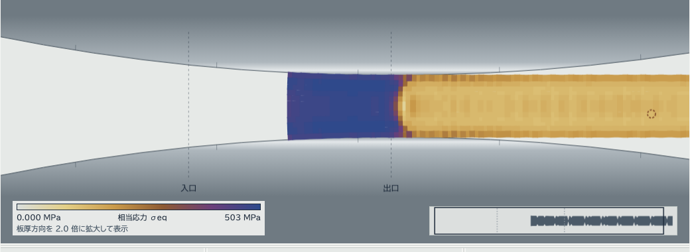

# 調査報告（2026-09-30）: ロールの撓み・長手方向の洗濯板・速度・メモリ・物理の妥当性・不具合

依頼: 「ロールたわみの計算結果」「圧延後の材料の長手方向の相当応力分布が洗濯板状に波打っている原因」「計算精度を犠牲にしない計算速度の改善案」「メモリ使用量の改善案」「物理的な計算の妥当性」を徹底的に調べ、「アプリの不具合」も徹底的に調べる。

基準は `main` 9135df3（2026-09-29）。予定は 02:47 だったが、前の作業と CI が済んでいたので 01:49（JST）に前倒しで始めた。
調べ方は、コードを読む係（数値スキームの対応表・撓み・2 次元と 3 次元のソルバー・ワーカーと URL と remote・2 次元と 3 次元の画面・力学の妥当性・プロファイル）を分けて回し、
自分で実験（洗濯板の変種、撓みの荷重の検算、残留応力）をして突き合わせた。実験のスクリプトはリポジトリの外（作業ディレクトリ）にあり、再現に要る条件はここに書く。
機械は Apple M2・8 GB・Node 24.14（A/B の比較だけ winpc: Core Ultra 7 265K・Node 24.15）。
プロファイルの係は 02:03 から出力が止まったので 02:55 に止め、係が残したプロファイル（`--cpu-prof`・`--trace-opt`・`--trace-deopt` の出力と集計のスクリプト）を引き取って自分で集計した（§3.3・§4.3）。

成果物:

| もの | 場所 |
|---|---|
| この報告 | `docs/investigation-2026-09-30.md`（PR: `docs/investigation-2026-09-30`） |
| 撓みの梁の荷重の修正 | PR #122 `fix/roll-bend-load` |
| 2 次元ソルバーの端の修正（非局所損傷 × 張力、GTN の f*、定常の板長） | PR #124 `fix/solver-2d-edges` |
| 3 次元の修正（スレッドの ready の競合、短い板の分割、`advance()` の誤用） | PR #123 `fix/solid-3d-edges` |
| ワーカー・URL・画面の修正 | PR `fix/workers-ui` |

## 1. ロールの撓みの計算結果

### 1.1 今の実装（`src/mpm/solid/rollBend.ts`・`Sim3.updateBend`）

- 梁: Euler–Bernoulli + Timoshenko のせん断（κ は Cowper）。I = πD⁴/64、D = 2R。E・ν は条件の `rollE`（206 GPa）・`rollNu`（0.3）
- 支持: z = ±span/2 の単純支持。span は既定でバレル長、`support3=bearing&span3=…` なら軸受間。張り出し（span > バレル）も胴と同じ D（ネックは無い）
- 荷重: 格子の接触の法線力を z の列ごとに足した `stepFz`（中央の列は 2 倍・`rollShare`）を、通過時間 / 4 の一次遅れで平滑化して q(z) に
- 解く頻度: CPU は毎ステップ、GPU はバッチ（K ステップ）ごと。δ に緩和は無い
- 当て方: ロールの軸を cy + δ(z) にずらす（+δ = 板から離れる）。1/4 モデルでは鏡像で板厚が +2δ。`bendVel` は 1 段遅れ
- 自重・バックアップロール・初期クラウン・軸受のばね・ベンダーは無い（`docs/model.md` の撓みの節に明記）

### 1.2 検算

| ケース | 手計算（曲げ + せん断） | `beamDeflection` | 比 |
|---|---|---|---|
| D 500 mm・支点間 1,500・板幅 1,000・10 MN 等分布 | 906.5 + 181.3 = 1,087.8 µm | 1,087.78 µm | 0.99996 |
| D 200・バレル 300・板幅 4・3.4 kN/mm | 0.932 µm | 0.935 µm | 1.003 |
| D 200・バレル 300・板幅 8・3.3 kN/mm | 1.803 µm | 1.800 µm | 0.998 |

梁の式そのものは正しい。符号・単位（N/m → kN/mm、µm）も画面・ツール・URL で一貫している。

### 1.3 見つかった不具合: 梁に載せる荷重が追従段の力を落としていた（PR #122）

接触は 2 段（格子の射影 `projectRoll` と、沈む点を押し戻す `followRoll`）だが、梁の荷重 `stepFz` には 1 段目の法線力しか足していなかった（CPU `followNodes`、GPU `advanceBatch` とも）。
報告する荷重と `byZ` は両段の和なので、梁だけが軽い荷重を見ていた。

| 条件 | 梁の荷重 / 報告の荷重 | δ（修正前 → 後） |
|---|---|---|
| 関門の条件 `roll-bend.mjs`（R 10 mm・板幅 4 mm・バレル 30 mm） | 0.925 | 5.43 → 5.82 µm |
| `node tools/solid.mjs --W 8 --L 12 --cells 4 --bend 300`（R 100 mm） | 約 0.98 | 1.63 → 1.67 µm |

修正: 追従段の力も `stepFz` に足す（CPU・GPU）。関門に「梁の荷重 = 報告の荷重（一次遅れの分 3 % まで）」を足し、壊した版で FAIL（1,578 vs 1,706 N）することを確かめた。
`docs/validation.md` の撓みの節を 2026-09-30 の値に直した（W 8 で 118 s、δ 1.67 / 1.66 µm、クラウン 0.01 µm）。

### 1.4 妥当性と限界

- **アプリの届く範囲（D 200 mm・バレル 300・板幅 ≤ 数十 mm）では δ は 1〜3 µm、板のクラウンへの寄与は 0.01〜0.03 µm で事実上ゼロ**。撓みが効くのは細いロール（関門の R 10 mm で 5.8 µm）だけ。画面で「撓み」を入れても平坦度がほぼ変わらないのは、モデルが壊れているのではなく、この幾何では撓まないため
- 実機の寸法（D 500・支点間 1,500・板幅 1,000・10 MN）では中央 1.09 mm の撓み = クラウン +1.09 mm。実機の狙いのクラウン 20〜60 µm の 20〜50 倍で、バックアップロール・初期クラウン・ベンダーの無い 2 段圧延機そのもの。4 段圧延機の代わりにはならない
- 張り出しを胴と同じ D で解くので、ネックの細い実機より撓みが小さく出る。`span3` を与えたときバレル < 板幅でも拒まない
- 荷重は法線力で鉛直成分ではない（噛み込み角では 1 % 未満）。落ち着きの判定の許容 0.25 µm は δ ≈ 1 µm の 25 % で緩い（`forceFlat` が先に効く）。W 8・バレル 300 では `bendSettled` に届かない（修正の前からで、退行ではない）
- ギャップ ⇄ 荷重のループの利得 2δ/Δh はアプリの範囲で 1e-2 の桁で発振しない。実機寸法でも安定

### 1.5 直すべきこと（優先順）

1. 済み: 梁の荷重に両段の力（PR #122）
2. `docs/model.md` の「δ ≈ 1 µm」を 1.7 µm に（PR #122 で済み）
3. 張り出しにネック径を持たせる（`neckD`）か、span > バレルのときの注を画面に
4. `bendSettled` の許容を δ の相対（例 5 %）に。今は絶対 0.25 µm
5. 4 段圧延機を扱うなら、バックアップロールとの接触（Winkler 床）を梁に足す。これが無いと実機寸法の撓みは 20 倍過大

## 2. 圧延後の相当応力が長手方向に洗濯板状に波打つ原因

### 2.1 測り方

粒子を**初期位置の列 i・行 j**（Lagrange の番地）で追い、出側 3.5 mm より先の列ごとの平均（列平均）と、行ごとの値を見る。
Euler の（x の等間隔の）ビンで平均すると、粒子の疎密で偽の周期が出るので使わない（最初の試みはこれで 0.5h・1.0h の偽の周期を出した）。
列平均の rms（列間 rms）・DFT の主な周期・隣の列と隣の行の相関・9 列の移動平均からのずれ（短い波の rms）を出す。
条件は標準（h0 1 mm・r 25 %・R 100・μ 0.08）、損傷なし、板長 8 mm、`done`（尾端が出口の 2 mm 先）の時点。

### 2.2 板厚方向の分布は物理（残留応力）

出側の行平均（6 セル、上面 → 下面）:

| 量 | 表層 | 2 行目 | 1/4 厚 | 中心 |
|---|---|---|---|---|
| σxx（全量）[MPa] | +122 | +76 | +27 | −2 |
| σeq [MPa] | 197 | 155 | 137 | 149 |

表層引張・内部圧縮で、断面の合力はほぼ 0（自己平衡）。Δ = 平均板厚 / 接触長 = 0.175 < 1 の「表層引張・内部圧縮」（Kalpakjian & Schmid の規則）と符号が合う。
大きさ ±100 MPa（2k の 0.15〜0.3）は文献の桁だが、**格子で未収束**（表層 σxx 6 セル +142 → 8 セル +72 MPa。条件は力学の係の測定、出口の先 2〜11 mm の行平均。
このスクリプトの値 +122 は列の範囲が違う）。表層の行の塑性ひずみが 2 行目より小さい（接触の行の拘束）のが主因で、格子を細かくすると減る。
色の量 σeq を出側で見たとき、**上下の表層が明るく中心が暗い横縞**はこれで、洗濯板ではない。

### 2.3 長手方向の波（洗濯板）は数値で、格子がつける



（`tools/browser/smoke.mjs` の画面、`?autorun=1&cells=6&L=8&stopafter=12000`。色の範囲 0〜503 MPa）

6 セル・ppc 2 の基準で、板厚中央の行の σeq を出側の 16 列で並べると:

```
153 144 139 157 | 151 140 137 155 | 151 140 138 157 | 153 143 139 154
```

**周期 4 列（初期の粒子間隔で 4 × dp = 2h、入側の 2 セル分）、振幅 ±10 MPa（平均 150 の 7 %）** の縞が板厚中央の行にあり、表層の行は ±5 MPa。
列平均では 2.6 MPa（行ごとに位相が違うので相殺する）。圧力（全量）も同じ 4 列の周期で ±5 MPa（板厚中央 80 MPa の 6 %）。
これが色の量で見える洗濯板で、範囲が 100〜250 MPa の 48 階調（1 階調 3 MPa）なら 6 階調の縞になる。

変種（同じスクリプト、`done` の時点、列間 rms は列平均の rms）:

| 変種 | σeq 列間 rms [MPa] | 圧力 列間 rms | 主な短い周期 | 読み |
|---|---|---|---|---|
| 基準 6 セル・ppc 2・ms 1e4・cfl 0.4・J-bar 'rate' | 2.64 | 2.25 | 4.06 列 = 0.451 mm（出側）= 入側の 2h | |
| 10 セル | 1.17 | 1.12 | 2 列 = 0.136 mm と長い波 | **h にほぼ比例して減る** |
| ppc 3（粒子 9 / セル） | 3.44 | 2.35 | 6.11 列 = 0.453 mm | **mm の周期が同じ → 粒子でなく格子が決める** |
| 質量スケーリング 1e3 | 2.42 | 1.11 | 2 列 = 0.225 mm | 圧力の波は半分、σeq は同じ |
| 質量スケーリング 1e5 | 4.56 | 3.98 | 長い波 | 悪化 |
| cfl 0.2 | 2.57 | 2.13 | 4.06 列 | 時間刻みは関係ない |
| μ 0.02 | 6.12 | 2.80 | 18〜24 列の長い波 | 荷重の低周波の揺れが乗る |
| J-bar なし | 12.2 | 12.6 | 2.03 列、隣の列の相関 −0.82 | 市松（体積ロッキングの圧力）。J-bar が抑えている |
| 接触 'stencil'（T27 前の帯） | 4.32 | 5.51 | 4.1 列 | 以前の接触は 2 倍悪い |
| 体積の平均化 'total' | 39.4 | 13.7 | 長い波 | 既知の圧力の拡散（`docs/model.md`「体積の平均化」）で別物 |
| β 緩和 0（`volRelax`・`volRelaxContact` 0） | 8,600 ステップで板の点が飛んで止まる | | | 'rate' の緩和は安定化の役も担う（要確認: 既定 1 以外の値の検証は無い） |

粒子ごとの縞の大きさ（行ごとの、9 列の移動平均からのずれの rms。σeq、MPa）:

| 変種 | 行の最大 | 板厚中央の行 | 表層の行 |
|---|---|---|---|
| 基準 6 セル・ppc 2 | 4.9 | 4.9 | 3.2 |
| 10 セル | 2.7（表層から 4 行目） | 0.8 | 1.2 |
| ppc 3 | 10.7 | 7.4 | 10.7 |
| 質量スケーリング 1e3 | 5.1 | 5.1 | 4.2 |
| J-bar なし | 40 | 12.8 | 40 |

粒子を増やす（ppc 3）と粒子ごとの縞はむしろ大きく、格子を細かくすると小さい。**縞を決めるのは格子で、粒子ではない**。

周期 0.45 mm（出側）は入側では 0.45 × 0.75 = 0.34 mm = 2h で、**荷重の振動の周期 2h / v_in**（`docs/validation.md`「荷重の振動」: 4・6・10 セルで 650・434・259 µs、
質量スケーリングで変わらない、格子横断の数値の揺れ）と同じ。板の材料が格子を 2 セル進むごとに、接触する節点の集合と重みが同じ配置に戻り、ロールの押しと塑性の増分が周期的に揺れ、
その揺れが各列の塑性の履歴（残留応力）に刻印される。板が出たあとも同じ列に残る（`done` の 3,000 ステップ後との同じ列の相関 σeq 0.82・圧力 0.90）ので、
弾性の鳴りや表示の格子の模様ではなく、材料に付いた縞。減衰は関係ない（減衰は入れていないし、弾性エネルギー / 塑性仕事 = 2e-8）。

3 次元（`Sim3`、板幅 4 mm・4 セル（h 0.25 mm）・板長 12 mm・1/4 モデル、50 s）も同じ: 板厚中央の行の σeq を出側の 16 列で並べると
`117 145 139 131 | 121 140 143 137 | 119 143 133 128 | 121 141 130 120` で周期 4 列（入側の 2h）。粒子ごとの短い波の rms は板幅中央の列で 18〜26 MPa（平均 137〜372 の 7〜15 %）、
板端の列で 15〜21 MPa。x の 1 mm ごとの平均では滑らか（σeq 235〜246 MPa）なので、平均で見ると隠れる。4 セルと粗い分、2 次元の 6 セル（4.9 MPa）より大きい。

### 2.4 結論

- **横縞（板厚方向の明暗）は残留応力で物理**。大きさは格子で未収束（8 セルで表層 σxx が半分）
- **縦縞（長手方向の洗濯板）は数値**。固定格子の上を粒子の列が進むときの接触（`projectRoll` の節点の集合と重み）の周期的な揺れが、周期 2h（入側）の塑性の履歴の差として材料に刻印される。振幅は格子 h にほぼ比例（6 → 10 セルで半分）、粒子数・時間刻み・質量スケーリングでは消えない。J-bar の 'rate' と接触 'surface' はこれを 2〜5 倍抑えている
- 荷重の 3 % の振動（既知）と同じ現象の、材料側の痕

### 2.5 対策（精度を落とさない順）

1. **表示だけ**: 出側の σeq を B スプラインで節点に平均してから描く「格子平均」の切り替え（計算は変えない。縞は 2h の周期なので 1 セルの平均で 1/3 程度に）。今は各点の値をそのまま描く
2. **格子を細かく**: 縞は h に比例。10 セルで基準の半分（1.2 MPa）。費用は 10 セルで 6 セルの約 5 倍
3. **接触の重みを滑らかに**: 'surface' は dx·n ≤ h/2 の節点を一括で射影する（0/1）。節点の法線距離で重み付け（例 (1 − 2 dx·n/h) の傾斜）にすると、粒子が格子をまたぐときの接触力の跳びが減る。荷重の平均は変わらないはず（検証: 荷重の振動の標準偏差 3 % → 下がる、荷重の平均 ±0.5 %）。実装は `projectRoll`・`followRoll`（2 次元）と `gridNodes`・`followNodes`（3 次元）・GPU カーネル
4. **初期配置にジッター**: 粒子の列を等間隔から少し乱す（dp の ±20 %）と縞が周期でなくなり雑音になる。決定的な種で再現性は保てる。平均は変わらないが、ビットで一致する検証値が全部変わる
5. やってはいけない: 人工粘性・減衰（縞は弾性でない。荷重の平均が変わる）、'total' に戻す（圧力の拡散）、J-bar を外す（市松）

## 3. 計算速度（精度を落とさない改善案）

「精度を落とさない」= 同じ入力で同じ結果（できればビット単位、少なくとも 1e-9）を出したまま速くする。時間刻み（`cfl`・質量スケーリング）・格子・粒子数を粗くする案は入れない。

### 3.1 今の構造で分かること（コードから）

- 1 ステップの仕事は P2G → 格子更新（接触）→ G2P 2 段（速度、体積の平均化 + 構成則）で、粒子 1 つあたり **B スプラインの 3×3 の重みを 4〜6 回計算し直す**（`p2g`・`g2pVelocity`・`g2pUpdate`・`followRoll`・`assignFields`・非局所。3 次元は 3×3×3 で `p2g`・`g2pVelocity`・`volumeMeans`・`g2pUpdate`）。重みは位置が変わらない限り同じなので、ステップの最初に 1 回計算して持てば（2 次元: 粒子あたり 9 + 9 の重みと基準節点、約 160 B）残りのパスは読むだけ。結果は同じ式・同じ順なのでビットで変わらない（丸めは同じ）。見込み: 粒子側の仕事の 20〜30 %
- **非局所の平均（`nonlocalAverage`）は毎パス全格子**を走る（活性範囲 `[gLo, gHi)` でなく）。`nonlocalLength > 0` のときだけ。活性範囲に限れば板長に比例する分が消える
- 2 次元のワーカーは **`handoff=steady`・2 スタンド以上の最初のフレームで `steadyLength()` が `new Sim(P)` を作る**（板全体の粒子を一時確保）。`TandemSim` が同じ長さを持っている（§4 にも）
- 格子は固定・全走行分を確保し、クリアと P2G・G2P は活性範囲だけ。ここは良い
- 3 次元の複数スレッド（`Team`）は段ごとの関門（6 段 × ステップ）で、板長が短いと関門の待ちが仕事に勝つ。GPU は K ≤ 20 ステップの一括で f32・CAS 加算（ビット再現なし。既に「精度を落とす」側）
- 描画: ワーカーはフレームごとに面（`faces()`）を新しい `ArrayBuffer` で送る。フレームの間隔が短い（33 ms）と GC が増える。「描画の更新」を遅くすれば消える（既にある）

### 3.2 案（効き目 × 手間）

| # | 案 | 結果 | 見込み | 手間 |
|---|---|---|---|---|
| 1 | B スプラインの重みをステップの最初に 1 回（粒子ごとの小さな配列） | ビットで同じ | 粒子側 20〜30 % | 中（2 次元・3 次元・GPU の 4 経路。2 次元から） |
| 2 | 非局所の平均を活性範囲に | 同じ | nonlocal のときだけ、板長に比例 | 小 |
| 3 | `steadyLength()` の `new Sim` をやめて `TandemSim` の値を読む | 同じ | 最初のフレームの 1 回（数百 ms〜数 s） | 小 |
| 4 | 3 次元の関門の回数を減らす（段の融合: G2PV と VMEAN は同じ粒子ループに乗る） | 加算順が変わらなければ同じ | スレッド数が多いときの待ち | 中〜大 |
| 5 | ~~V8 の最適化はずれ（deopt）の除去: 3 次元の `g2pVelocity` に 5,000 回~~ → 測ったら効き目なし（§3.3。取り下げ） | 同じ | 0 %（実測） | — |
| 6 | 粒子の配列を Float32 に | **1e-7 の桁で変わる**（検証値がビットで合わなくなる） | メモリ半分・速さ 10〜20 % | 中 |

6 は「精度を落とさない」に入らないので採らない。

### 3.3 測定（2026-09-30、Apple M2・8 GB・Node 24.14。V8 の `--cpu-prof`）

条件は 2 次元が `tools/run.mjs --cells 6 --L 8`（標準条件、9.4 s 分の標本）、3 次元が `tools/solid.mjs --W 4 --L 12 --cells 4`（1/4 モデル、6,144 点、12,500 ステップ、54 s、1 ステップ約 4 ms）。関数ごとの自己時間（その関数の中で、呼び出し先を除いた時間）の割合:

| 2 次元（`solver.ts`） | 自己 % | | 3 次元（`solid/sim3.ts`） | 自己 % |
|---|---|---|---|---|
| `g2pUpdate`（G2P 2 段目 + 構成則の呼び出し） | 41.6 | | `g2pUpdate` | 35.1 |
| `p2g` | 23.6 | | `g2pVelocity`（速度 + APIC の B + 体積平均の散布） | 31.4 |
| `g2pVelocity` | 17.7 | | `p2g` | 24.6 |
| `followRoll` | 3.8 | | `maxPrincipal` | 1.3 |
| `gridUpdate`（接触を含む） | 3.8 | | `gridNodes` | 1.2 |
| `flowStress`（`material.ts`） | 3.6 | | `plasticIncrement` | 1.1 |
| `rateFactor` | 1.7 | | `flowStress` | 1.0 |
| `assignFields` | 0.6 | | `followScatter` + `followNodes` | 1.6 |
| GC | 0.7 | | `volumeMeans` | 0.4 |
| | | | GC | 0.3 |

読み方:

- **粒子の 3 つのループ（P2G・G2P の速度・G2P の更新）で 2 次元 83 %・3 次元 91 %**。構成則（`flowStress`・`plasticIncrement`・`rateFactor`・`staticStrength`）は 2 次元 5 %・3 次元 2.5 % しかなく、格子の処理（接触・追従を含む）は 8 % / 3 %、GC は 1 % 未満。速くするなら粒子のループの中身（重みの計算と 9 / 27 節点の読み書き）で、§3.2 の 1（重みを 1 回）がそこに当たる。構成則を触っても効かない
- 3 次元の `g2pVelocity` が `g2pUpdate` と同じ重さなのは、27 節点の速度の集めと APIC の B（9 成分）に加えて、体積の平均化の 4 つの和（θ・J の弾性分・β・質量）を**もう 1 回 27 節点に散布**しているから（2 次元は 9 節点で同じ構造、`g2pUpdate` の 0.43 倍）。この散布は `p2g` と同じ節点・同じ重みなので、重みを持ち回れば計算し直す分（2 回目の 27 通りの重みと添字）が消える
- 時間を 5 s の窓で切った割合は、`g2pVelocity` 28〜36 %・`g2pUpdate` 32〜36 %・`p2g` 23〜27 % でほぼ平ら。噛み込みと尻抜けで `g2pVelocity` の割合が上がるのは、塑性の点が減って `g2pUpdate` が軽くなるため（物理）

**V8 の最適化はずれ（deopt）**: `--trace-deopt` で 2 次元は 31 回（全部立ち上がりの型の学習。`gridUpdate` の OSR 抜け 6 回・`g2pVelocity` `p2g` の wrong map）。3 次元は 5,072 回で、うち 5,058 回が `g2pVelocity` の「exit from OSR'd inner loop」（TurboFan の版が 1 回 "Insufficient type feedback for compare operation" で外れたあと、内側のループだけを Maglev が OSR で最適化した版に入っては抜けるのを呼び出しのたびに繰り返し、TurboFan の版が戻るのは終わり近く）。**実害を A/B で測った**（winpc、同じ条件、2 回ずつ + trace 付き 1 回ずつ）: 比較の型の学習を最初から済ませる 1 行の変種と元とで、

| | 元 | 変種 |
|---|---|---|
| 壁時計 [s]（2 回 + trace 付き） | 39.29 / 39.12 / 39.26 | 39.26 / 39.19 / 39.04 |
| `g2pVelocity` の OSR 抜け（trace 付きの回） | 0 | 5,733 |
| 結果（`--json` の全量の md5） | 同じ | 同じ |

つまり OSR 抜けの繰り返しは JIT の段階移行のタイミングの競合で起きたり起きなかったりし（Mac では元で 5,058 回、winpc では元で 0 回・変種で 5,733 回）、**起きても時間は変わらない**（差 0.5 % 未満、測定のばらつきの中）。Maglev の OSR の版が同じ速さで走っている。§3.2 の 5 は取り下げ。

以上から、精度を落とさない改善の本命は §3.2 の 1（B スプラインの重みと節点の添字をステップの最初に 1 回だけ計算し、3 つのループで使い回す）。粒子ごとに 2 次元で 9 + 9 の重みと基準節点、3 次元で 27 の重み（または 3 + 3 + 3 の 1 次元の重みと基準節点 = 12 個）を持てばよく、メモリは点あたり 100〜250 B（§4.3 の測定で点は 300〜350 B なので最大 1.7 倍）。実装は 2 次元の `p2g`・`g2pVelocity`・`g2pUpdate` の 3 か所から始め、`tools/checks/rolling-smoke.mjs` の既定の荷重のビット一致で留める。

## 4. メモリ使用量の改善案

### 4.1 どこが食うか（コードから）

- **ソルバーの粒子と格子は小さい**: 2 次元の標準 10 セル（6,400 点）は粒子の状態 30 前後の Float64 で約 1.5 MB、格子（全走行分 265 × 12 節点）も MB 未満。3 次元 W 8・L 12・4 セルの 1/4 モデル（約 6,000〜12,000 点）も数 MB
- **大きいのは板幅を広げたとき**: 板幅 2,000 mm（`feat/width-2000`）の 3 次元は、4 セル（dp 0.125 mm）・板長 12 mm の 1/4 モデルで z の列が 8,000 ×（x 96 × y 4）= 約 300 万点 → 1 点 30 × 8 B で **約 700 MB**（概算。実測は §4.3）。複数スレッドは `grid3.ts` の格子の写しをスレッドごとに持つ（同期の塊）ので、格子の分 × スレッド数。ここが 8 GB の機械で効く
- **平面図**: `MAX_POINTS = 500,000`（`query.ts`）で 1 点 20 前後の Float64 → 上限で **約 80 MB** + 格子
- **巻き戻し再生のテープ**（`tape.ts`）: 400 枚・160 MB の上限。3 次元の面のデータは 1 枚数百 kB〜数 MB で上限に届く → 間引き
- **追っている点**（`tracker3.ts`）: 上限 600
- **ワーカーと画面の二重持ち**: フレームは面のデータの写し（転送でなく複製のときは 2 倍）。remote（winpc）ではさらに WebSocket のバイナリ
- **`steadyLength()` の `new Sim`**（§3.1）: 板全体の粒子をもう 1 組、最初のフレームだけ
- **条件の比較**: 1 条件ずつ順に回すので同時に 1 つ。ただし `summaries` と `cases` の履歴は残る（小さい）

### 4.2 案

| # | 案 | 効き目 | 手間 |
|---|---|---|---|
| 1 | `steadyLength()` の `new Sim` をやめる（§3.2 の 3） | 最初のフレームの一時的な倍 | 小 |
| 2 | 3 次元の格子の写しをスレッドごとに持たず、活性列（`ixLo..ixHi`）の分だけ | 広い板・多スレッドで格子の分 × (N − 1) | 中 |
| 3 | 粒子の配列のうち書き戻さない量（`seq`・`eta`・`s1` など読みの量）をフレームの時だけ計算して送る | 1 点 3〜5 × 8 B | 小〜中（`readField` の経路） |
| 4 | テープの上限を機械のメモリ（`navigator.deviceMemory`）で決める（8 GB では 80 MB） | 3 次元の長い再生で 80 MB | 小 |
| 5 | フレームの面のデータを転送（`transfer`）で送り、画面側で使い回す | 複製の分 | 小（既に転送のところは済み） |
| 6 | 粒子の Float32（§3.2 の 6） | 半分 | 精度を落とすので採らない |

### 4.3 測定（2026-09-30、Node 24.14、`--expose-gc`。`process.memoryUsage()` と、到達できる型付き配列を buffer で重複を除いて合計）

| 条件 | 点 | 格子の節点 | 型付き配列の合計 | rss [MB]（作った直後 / 200 ステップ後） | heapUsed [MB] |
|---|---|---|---|---|---|
| 2 次元 6 セル・L 8 mm | 1,152 | 179 × 15 = 2,685（dfg の 2 場で配列は ×2） | 1.3 MB（84 本） | 94.8 / 95.7 | 8.4 / 8.9 |
| 2 次元 10 セル・L 16 mm（標準） | 6,400 | 483 × 19 = 9,177 | 5.2 MB | 96.2 / 87.8 | 8.9 |
| 3 次元 W 4・4 セル・L 12（1/4） | 6,144 | 165 × 8 × 16 = 21,120 | 4.4 MB（58 本） | 88.6 / 93.9 | 8.9 / 9.2 |
| 3 次元 W 8・6 セル・L 12（1/4） | 41,472 | 238 × 9 × 37 = 79,254 | 23.0 MB | 99.1 / 73.6 | 9.2 |

Node の素の rss が約 90 MB なので、この範囲ではソルバーの分は誤差。3 次元 W 4 の 1 パス丸ごと（12,500 ステップ）の最大 rss は 111 MB、V8 のヒープの最大は 67 MB。

2 条件ずつの連立から 1 点・1 節点あたりの大きさ: **2 次元は点 約 310 B・節点 約 180 B（dfg の 2 場込み）、3 次元は点 約 350 B・節点 約 105 B**。これで広い板を概算すると（§4.1 の目安の裏付け）、板幅 2,000 mm・4 セル（h 0.25 mm）・L 12 mm の 1/4 モデルは点 96 × 4 × 8,000 ≈ 307 万で約 1.1 GB、格子 165 × 8 × 4,000 ≈ 530 万節点で約 0.56 GB、**合わせて約 1.6 GB**。複数スレッドは格子の写しがスレッドごとなので、5 本なら格子だけで約 2.8 GB になり、8 GB の機械では §4.2 の 2（写しを活性列の分だけに）が要る。`feat/width-2000`（PR #119）の実際の刻みで読み替えること。

画面側（テープ 160 MB の上限・フレームの複製・追っている点）は測っていない。3 次元の面のデータは 1 枚数百 kB〜数 MB なので、長い再生では上限に届く（§4.2 の 4）。

## 5. 物理的な計算の妥当性

目的（応力状態から亀裂の発生を判定）に対する影響の順:

1. **損傷・三軸度が格子で収束していない、正則化が効かない**: 中心割れの板厚中心の η は 8 / 12 / 16 / 32 セルで +0.06 / +0.15 / +0.20 / +0.23（`docs/validation.md`、`docs/presets.md`）で、Hill の滑り線場の +0.39 に届かない。割れる延性の閾値は格子で 2 倍動き、割れの間隔は 2.7〜4 セル。`nonlocalLength` は既定 0 で、入れても直らない。→ **傾向（どこが危ないか）は出るが、閾値と割れの間隔は数値でない**
2. **損傷の定数が材料と合っていない**: 既定は SPCC の流動応力に 4340 鋼の Johnson–Cook 損傷定数。SPCC 用の校正値が無い。Cockcroft–Latham の 0.6 も未校正
3. **平面ひずみの σzz と無限幅**: 出側で σzz ≈ −130 MPa が板厚全体に残る（J2 平面ひずみの帰結で式は正しい）。実板は幅方向に広がって逃がす。表層の出側の η は 0.10 と低め。耳割れの起点は断面モデルでは原理的に見えない（平面図・3 次元で）
4. **残留応力の大きさが未収束**（§2.2）。符号は安定。`docs/validation.md` に標準条件の残留応力の節が無い
5. **μ 0.08 は潤滑冷延の実測 0.015〜0.03 の 3〜5 倍**（`docs/model.md` に注あり）。中立点 MPM −1.42 vs スラブ法 −1.61 mm のずれの半分は慣性
6. **慣性（質量スケーリング 1e4）**: 縦波 59 m/s、Mach 0.017、運動エネルギー流束 / 塑性仕事 0.13（1e3 で 0.013）。実機の 10 m/s は 4.6e-4 で、計算は実機の 100 倍の慣性。1e4 → 1e3 で荷重 3.245 → 3.242 kN/mm、トルク −10 %、中立点 −1.417 → −1.474 mm、先進率 3.29 → 3.39 %。荷重・残留応力・η への影響は ≤ 0.03
7. 荷重は格子 ±3 %（6 / 10 / 14 / 20 セルで 3.24 / 3.11 / 3.18 / 3.17 kN/mm）、スラブ法比 +5 %（出口先の弾性接触 4〜5 % と慣性）
8. 亜弾性 + Jaumann は噛み込み角 2.9°・γ ≪ 1 で誤差無視可。弾性回復 0.1 % は妥当。Hitchcock の C = 16(1 − ν²)/(πE) は正しく、一次遅れで不動点に落ち着く。ひずみ速度の実機換算（millSpeed / rollSpeed = 10 → 665 /s）は流動応力・損傷・スラブ法で一貫。発熱は既定 off（χ = 0）、on でも荷重 −1.7 %
9. 3 次元は W 2〜40 mm・接触長 5 mm で W/Lc 0.4〜8 = 棒圧延の領域（幅広がり 14 / 12 / 8 / 1.4 %、W 8 で 7.9 → 7.6 %（4 → 6 セル）vs Wusatowski 8.8 %）。既定の細幅は耳割れの応力状態を誇張する。平面図の幅方向配分は +20〜30 % 未収束
10. 文書のずれ: `docs/validation.md` の 6 セルの先進率「4.1 → 5.4 %」は最後の 1 窓の値で、定常平均 2.9〜3.3 % と食い違う。残留応力の行（'rate' 表層 +108 / 中心 −72）は条件が書かれていない。χ = 0 が既定と明記されていない

## 6. アプリの不具合

重要度: 高 = 結果が黙って間違う / 止まる、中 = 条件によって間違う・固まる、低 = 表示・操作の不便。「PR」は対応する修正の枝（無印は未着手・要判断）。

### 6.1 ソルバー（結果に効く）

| # | 場所 | 重要度 | 症状 | PR |
|---|---|---|---|---|
| 1 | `sim3.ts` `followNodes`・`advanceBatch` | 中 | 撓みの梁の荷重が追従段の力を落とす（§1.3） | #122 |
| 2 | `team.ts` `runWorker` | 中 | `postMessage('ready')` の後で世代を読む → 調整役が先に世代を進めると永遠に待つ（スタンド切り替えのたびに窓） | #123 |
| 3 | `solver.ts` 非局所損傷の `fail` | 中 | `inGrip` を見ずに壊す → 張力中に掴みの点が壊れ、張力が偏差 0 の点に載る | #124 |
| 4 | `solid.worker.ts` + `team.ts` | 中 | 複数スレッドのタンデムでスタンドの継ぎ目（attach 中）に「やり直す」→ 旧 attach の 'ready' が新 attach を解決 → 結果が黙って壊れる | 要着手（attach に世代番号） |
| 5 | `sim3.ts` `partition` | 低 | 板長がセル 1 列 × スレッド数より短いと区間が 1 列幅になり、質量 23 % 欠け（画面では届かない。`tools/solid.mjs --threads` と短い板） | #123 |
| 6 | `sim3.ts` `advance()` | 低 | `{shared, size > 1}` や GPU 付きの `Sim3` に `advance()` を呼ぶと rank 0 の区間だけで黙って間違う | `fix/solid-3d-edges`（throw） |
| 7 | `material.ts` `gtnFstar` | 低 | 上限なし。`yield=gtn` かつ損傷が GTN でないとき f > fF で降伏面が裏返り弾性扱い（再硬化） | #124 |
| 8 | `tandem.ts` `steadyLength` | 低 | 質量スケーリングで c ≤ 10 vIn になると板長が負（ms 1e6 で −54 mm。URL は 1e8 まで許す） | #124 |
| 9 | `gpu/kernels.ts` `penOf` | 低（潜在） | `penKey` の逆関数になっていない（符号しか使わないので今は無害） | 未 |
| 10 | `sim3.ts`・`kernels.ts` 追従の散布 | 低 | y のゴースト行（iy = 0）を読み替えない。gap < h + dp（4 セルで r > 62 %）のときだけ | 未 |
| 11 | `solver.ts`・`planview/sim.ts` | 低 | `mMin = 1e-12 mass[0]` は n = 0 で undefined（板長 < dp のときだけ） | 未 |
| 12 | `tandem.ts` | 低 | 亀裂のある板で「定常の出側板厚」と「引き継ぎ時の板厚」の粒子の集合が違う | 未 |

### 6.2 ワーカー・URL・remote

| # | 場所 | 重要度 | 症状 | PR |
|---|---|---|---|---|
| 13 | `query.ts` `mat=`・`cond` | 中 | `?mat=constructor` で `MATERIALS[mat]` が prototype の関数 → 材料の定数が全部 undefined → NaN。`cond` の最上位キー `toString` も同様 | `fix/workers-ui` |
| 14 | `tools/remote/server.mjs` | 中 | ws に `on('error')` が無い → 受信側のプロトコルエラーで計算サーバ全体が落ちる | 要着手 |
| 15 | `sim.worker.ts`・`solid.worker.ts` | 低〜中 | 描画の更新 = 5 秒のとき約 5 秒イベントループに戻らない → 一時停止・色の量・選択・やり直すが最大 5 秒待つ | `fix/workers-ui` |
| 16 | `solid.worker.ts` CPU の loop | 低 | `advance()` が throw すると running=true のまま → 以後の「続ける」が無視 | `fix/workers-ui` |
| 17 | `solid.worker.ts` `setCompute` | 低 | void 呼び出しで await 後の throw（広い板・8 セルの確保失敗）が unhandled → 「格子と点を用意している」のまま | `fix/workers-ui` |
| 18 | `solidMode.ts`・`solid.worker.ts` `run()` | 低 | attach 中の Sim3 を step できる（`__mpm.solid.run()`） | `fix/workers-ui` |
| 19 | `solid.worker.ts` GPU 中の init | 低 | mapAsync 中に destroy → reject → 「計算が止まった」が一瞬出る | `fix/workers-ui` |
| 20 | `sim.worker.ts` | 低 | `handoff=steady` の最初のフレームで `steadyLength()` が `new Sim` を作る（TandemSim と二重確保） | §4 |
| 21 | `server.mjs` `/quit` | 低 | 認証なし・CORS * → 任意のページが計算サーバを終了できる（Chrome の PNA で大半は止まる） | 未 |
| 22 | `server.mjs` | 低 | EADDRINUSE で 0.8 秒ごとの listen を無限に繰り返す | 未 |
| 23 | `remote.ts`・`machineStats.ts` | 低 | Windows で `npm run dev` を素で開くと自機が「winpc」表示。Mac の行のツールチップも winpc の文言。place 'mac' でサーバ無しでも 1.5 秒ごとに `Failed to fetch` | 未 |

### 6.3 画面

| # | 場所 | 重要度 | 症状 | PR |
|---|---|---|---|---|
| 24 | `panel.ts` `hasBite` | 中 | 幾何で噛めない編集は h0・r・R を黙って基の値に戻す（欄は編集済みのまま → 反映されたように見える）。摩擦（√(Δh/R) > μ）は見ないので R 5・h0 1・r 70 % は通って 'stalled' | `fix/workers-ui`（表示。摩擦は要判断） |
| 25 | `tape.ts` | 低 | バイト上限で間引いたとき最後の枚が落ち、動画に終状態が入らない | `fix/workers-ui` |
| 26 | `view.ts` `stampBorn` | 低 | 鍵を消さない → 同じ条件でやり直すと 2 回目以降の亀裂の印が押されない | `fix/workers-ui` |
| 27 | `export.ts` | 低 | 圧力分布・亀裂の CSV と名前の step が最後のスタンドで、表示中のスタンドを無視 | `fix/workers-ui` |
| 28 | `viewControls.ts` | 低 | ダブルクリックで click が 2 回先に届き、選択中の点が変わる | `fix/workers-ui` |
| 29 | `planMode.ts` | 低 | 点が上限を超えると幅・セルを黙って既定に戻す | `fix/workers-ui`（注を出す） |
| 30 | `solidMode.ts` | 低 | 動画の書き出し中の「続ける」「やり直す」で abort しない → 絵がずれる。再生の 1 枚の間隔が 80 ms 固定でテープを間引いたあと 2 倍・4 倍速。一時停止直後の「続ける」で飛行中の pause フレームが running を戻す | `fix/workers-ui`（abort）、他は未 |
| 31 | `splitters.ts`・`styles.css` | 低 | 1,101〜1,250 px で分割線を端まで引くと絵が 0〜数十 px。`.bite` < 650 px で凡例と俯瞰が重なる | 未 |
| 32 | `solidMode.ts` | 低 | init 直後に旧 run の stand > 0 の 'ready' が届くと geometry を上書き | 未 |

問題なしと確かめたもの（抜粋）: B スプラインの重みの和・3×3 の範囲、dfg、Jaumann の符号、J2 の Newton、断熱昇温、接触 'surface'、張力のランプと `gripCols`、タンデムの `remap`（全状態）、スラブ法の RK4、
平面図の質量・接触・切り欠き、3 次元の対称面の畳み込み（APIC の C まで）、GPU の境界・CAS・uniform、チームの関門と部分和、`tandem3.remap3`、`steady.ts`、`flatShape`、
メッセージ型の一致、転送済み配列の再利用なし、`remoteCodec` の整列、URL の往復、CSV の単位と列順、ETA、DPR、WebCodecs / mux、半厚の鏡像、tracker の `remap`。

## 7. 推奨する次の一手

1. 修正 PR（#122、`fix/solver-2d-edges`、`fix/solid-3d-edges`、`fix/workers-ui`）の CI を見てマージ
2. 洗濯板: まず表示の「格子平均」（§2.5 の 1）。次に接触の重みの傾斜（§2.5 の 3）を関門付きで試す。荷重の振動の標準偏差（`docs/validation.md`「荷重の振動」の 3.2 %）が指標
3. 妥当性: SPCC 用の損傷定数の校正（少なくとも文献値の出典を `docs/model.md` に）、標準条件の残留応力の節を `docs/validation.md` に（格子 6 / 8 / 10 セル）
4. 撓み: 4 段圧延機を扱うならバックアップロール。扱わないなら画面に「2 段圧延機の撓み」と明記
5. 残る不具合の着手順: #4（attach の世代）→ #14（ws の error）→ #24 の摩擦条件 → #31・#32
